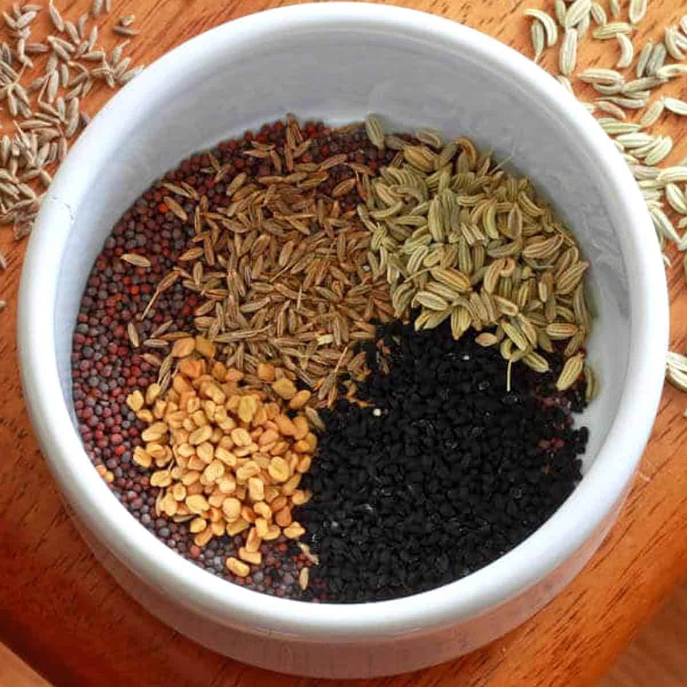

# Panch Poran (Indian Five Spice)

## Overview
A traditional whole spice blend commonly available in Asian spice shops already mixed. Panch poran varies from region to region across the Indian subcontinent, but this is the most common blend in UK curry houses. Equal amounts of each ingredient are used, making it easy to scale this recipe up or down.

**Makes:** 5 tablespoons
**Prep Time:** 2 minutes
**Cook Time:** 2 minutes

## Ingredients
- 1 tbsp cumin seeds
- 1 tbsp fenugreek seeds
- 1 tbsp brown mustard seeds
- 1 tbsp fennel seeds
- 1 tbsp nigella seeds (black onion seeds)

## Method

### Stage 1 – Roast & Use
1. For best results, roast the spices in a dry frying pan over medium–high heat until fragrant.
2. Use immediately while warm for maximum flavour release.

## Notes
- **Fenugreek adjustment:** Some cooks prefer to use less fenugreek as the seeds can be quite bitter, experiment to find your preference.
- **Whole spice blend:** Unlike ground masalas, panch poran is traditionally used whole for textural contrast and flavour bursts.
- **Pre-made option:** Available ready-mixed in most Asian spice shops if you prefer convenience.

## Storage
- Store in an airtight container in a cool, dark place
- Use within 3 months for optimal flavour
- Roast just before using for fresher taste