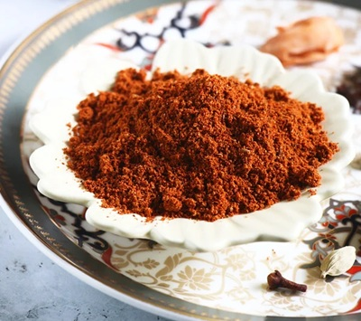

# Tandoori Masala

## Overview
A versatile spice blend traditionally used for tandoori cooking. Most commercial tandoori masalas rely on salt, citric acid powder, and cheap ground spices with red food colouring. This homemade version uses more quality spices and substitutes natural amchoor (dried mango powder) for artificial tanginess, giving you greater control over the final flavour.

**Makes:** 120g (1¼ cups)
**Prep Time:** 8 minutes
**Cook Time:** 2 minutes

## Ingredients
- 3 tbsp coriander seeds
- 3 tbsp cumin seeds
- 1 tbsp black mustard seeds
- 5cm (2in) piece of cinnamon stick or cassia bark
- Small piece of mace
- 3 dried Indian bay leaves (cassia leaves)
- 1 tbsp ground ginger
- 2 tbsp garlic powder
- 2 tbsp dried onion powder
- 2 tbsp amchoor (dried mango powder)
- 1 tbsp (or more) red food colouring powder (optional)

## Method

### Stage 1 – Roast Whole Spices
1. Roast the coriander seeds, cumin seeds, black mustard seeds, cinnamon, mace, and bay leaves in a dry frying pan over medium–high heat until warm to the touch and fragrant.
2. Move them around in the pan as they roast, being careful not to burn them.
3. If they begin to smoke, remove from heat immediately.

### Stage 2 – Cool & Grind
1. Tip the warm spices onto a plate and leave to cool completely.
2. Grind to a fine powder in a spice grinder or pestle and mortar.

### Stage 3 – Mix & Colour
1. Add ground ginger, garlic powder, onion powder, and amchoor to the ground spices.
2. Stir in red food colouring powder (if using). The masala will not look overly red like commercial brands.
3. Mix thoroughly.

## Notes
- **Colour note:** Food colouring powder becomes redder when stirred into a sauce, so don't overdo it.
- **Without colouring:** Omit the food colouring powder for a more natural appearance, the spices are flavorful enough without it.
- **Amchoor substitute:** If amchoor is unavailable, use a pinch of citric acid powder or extra lemon zest.

## Storage
- Store in an airtight container in a cool, dark place
- Use within 2 months for optimal flavour