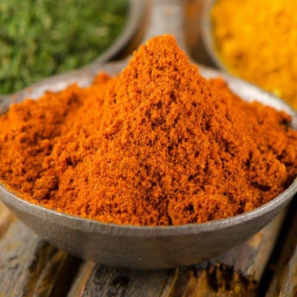

# Vindaloo Spice Mix

## Overview
A hot, sharp spice mix designed to complement vinegar-based curries. High in chilli with warm supporting spices.

## Ingredients
- 2 tsp chilli powder
- 1 tsp cumin
- 1 tsp coriander
- ½ tsp black pepper
- ¼ tsp cloves
- ¼ tsp cinnamon

## Method
1. Mix all spices together.
2. Store airtight.

## Notes
- Designed for heat and acidity; typically combined with vinegar and garlic.
- Increase chilli powder for additional heat.

## Serving
Use 2–3 tsp in marinades or curries.

## Storage
- Store in an airtight container in a cool, dry place for up to 6 months
- Keep away from direct sunlight and moisture
