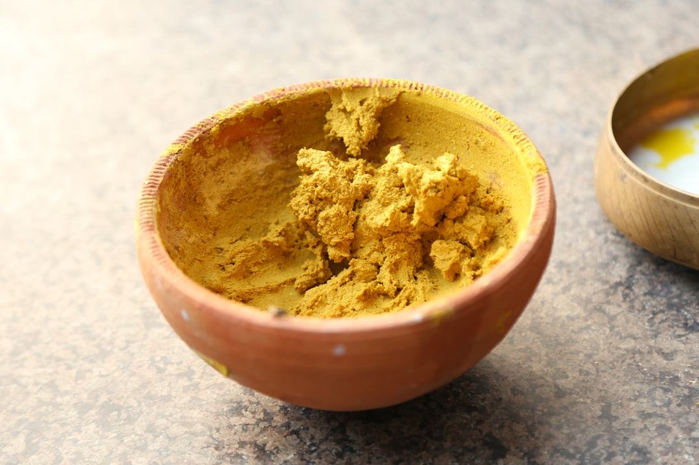

# Chasni Paste

**Makes:** About 1 cup

**Prep Time:** 5 minutes

## Overview
A sweet and tangy paste used in Pathia and Chasni curries, combining mango chutney, tomato ketchup, and lemon juice for a vibrant flavor base.

## Ingredients
### Sweeteners
- 175 g mango chutney

### Sauces
- 4 tbsp tomato ketchup

### Acid
- 4 tbsp lemon juice

### Color
- 2 tsp red food colouring

## Method

### Stage 1 – Combine ingredients
1. Place all ingredients in a bowl.

### Stage 2 – Blend
1. Blend into a smooth paste using a blender or immersion blender.

## Notes
- Adjust lemon juice for desired tanginess.
- Store in an airtight container to maintain freshness.
- Used as a base for curries; adds sweetness and color.

## Serving
- Not served directly; incorporated into curries.

## Storage
- Refrigerate in airtight container up to 2 weeks.
- Freeze in small portions up to 3 months; thaw before use.

