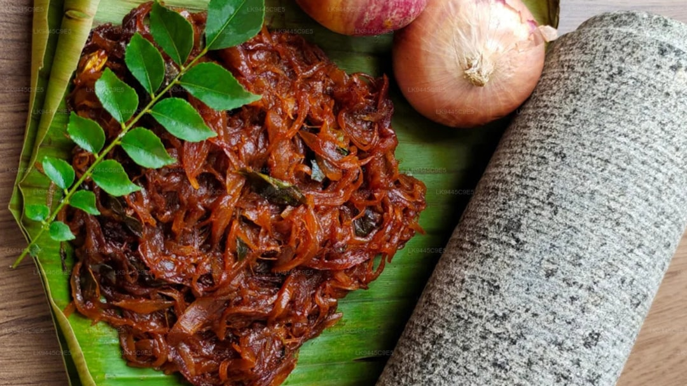

# Fried Onion Paste

**Makes:** About 1 cup paste

**Prep Time:** 5 minutes

**Cook Time:** 5 minutes

## Overview
Essential base for dopiaza curries, biryanis, and marinades. Fried onions add rich flavor and texture; the cooking oil can be reused in curries for extra taste.

## Ingredients
### Fat
- Rapeseed oil, for deep-frying (enough to cover onions)

### Vegetables
- 2 large onions, finely sliced

### For paste
- Water or yoghurt, as needed for blending

## Method

### Stage 1 – Fry onions
1. Heat oil in large heavy-based pan over high heat.
1. Test oil by dropping a piece of onion; it should sizzle and float.
1. Add sliced onions; fry until light brown, about 5 mins.
1. Remove with wire mesh spoon to paper-lined plate to drain.

### Stage 2 – Make paste
1. Once cool, add a little water or yoghurt.
1. Blend to smooth paste.

## Notes
- Onions will darken further after frying, so remove when light brown.
- Reuse the oil in curries for enhanced flavor.
- Store paste in fridge for up to 1 week.

## Serving
- Not served directly; used as ingredient in curries and marinades.

## Storage
- Refrigerate paste in airtight container up to 1 week.
- Freeze up to 1 month; thaw before use.
- Store fried onions separately if not making paste immediately.
