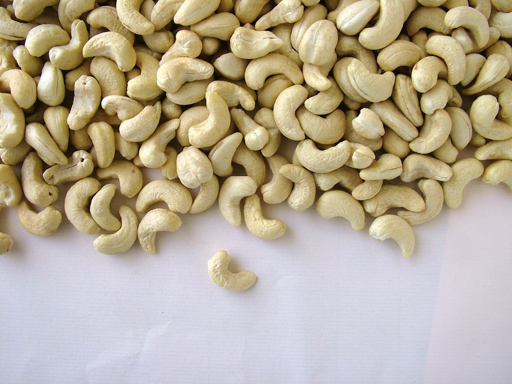

# Raw Cashew Paste

**Makes:** Variable (as needed)

**Prep Time:** 35 minutes

## Overview
A simple paste made from soaked raw cashews, used to thicken and flavor curries. Adds creaminess and richness without cooking.

## Ingredients
### Nuts
- Raw cashews, quantity as needed

### Liquid
- Cold water, for soaking and blending (enough to cover cashews and blend)

## Method

### Stage 1 – Soak cashews
1. Soak raw cashews in cold water for about 30 minutes.

### Stage 2 – Blend to paste
1. Drain cashews.
1. Place in spice grinder or blender.
1. Add just enough fresh water to blend to smooth paste.

## Notes
- Use in curries for thickening and flavor.
- Adjust water for desired consistency.
- Raw cashews provide a fresh, nutty taste.

## Serving
- Not served directly; incorporated into curries.

## Storage
- Refrigerate in airtight container up to 3 days.
- Freeze up to 1 month; thaw before use.