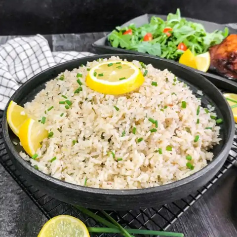

# Lemon and Garlic Fried Rice

*This is a light, aromatic fried rice perfumed with fresh lemon and garlic. The technique is simple but precise: cold cooked rice, hot oil, fragrant aromatics, and a quick toss. You can get really creative with fried rice; for onion fried rice, simply fry some onion in the oil then stir in the cold, cooked rice.*

**Serves:** 2

## Overview
This is the quickest rice dish in the Indian repertoire. Cold cooked basmati rice, already separated grain-by-grain, meets hot oil infused with garlic and ginger. The heat separates the grains further and coats them with flavorful aromatics, while fresh lemon juice adds brightness and acidity. Chives provide a fresh finishing touch. This is best served immediately while still warm.

## Ingredients

### Base
- 500 ml (2 cups) cold cooked basmati rice (prepared the day before or several hours ahead)
- 3 tablespoons rapeseed oil or ghee

### Aromatics
- 1 teaspoon garlic and ginger paste
- Finely grated zest of 2 unwaxed lemons
- Juice of 1-2 fresh lemons

### Finishing
- 3 fresh chives (finely chopped)
- Salt to taste

## Method

### Stage 1 – Heat Oil & Add Aromatics
1. Heat the rapeseed oil or ghee in a large frying pan over medium-high heat until bubbling hot.
2. The oil should shimmer and almost smoke; this is the correct temperature for fried rice.
3. Add the garlic and ginger paste along with the lemon zest.
4. Fry for about 30 seconds, stirring constantly.
5. The aromatics should become fragrant without browning.

### Stage 2 – Add Cold Rice
1. Add the cold rice to the hot oil, stirring gently and continuously.
2. Break up any clumps with the back of a wooden spoon.
3. Stir gently for about 2 minutes until all the rice grains are nicely coated with the oil.
4. The rice should heat through completely; it should be steaming and piping hot.

### Stage 3 – Finish & Serve
1. When the rice is completely hot, remove the pan from heat.
2. Squeeze in the lemon juice to taste (use 1-2 lemons depending on flavor preference).
3. Season with salt to taste.
4. Top with the chopped fresh chives.
5. Toss gently one final time and serve immediately.

## Notes
- **Cold Rice Imperative:** Always use cold cooked rice from the previous day or several hours prior. Hot, fresh rice will clump badly and create a mushy texture instead of separate grains.
- **Oil Temperature:** The oil must be hot enough to make the rice sizzle immediately upon contact. This heat separates the grains and creates the signature texture.
- **Gentle Stirring:** Use gentle, continuous stirring to coat all rice without breaking the grains or creating a mushy consistency.
- **Lemon Timing:** Add lemon juice at the very end to preserve its fresh, bright flavor; cooking it too long mellows the acidity.

## Variations
**Onion Version:** Fry 1 chopped onion in the oil before adding the rice for a different flavor profile.
**With Vegetables:** Scatter cooked peas, corn, or diced carrots through the rice with the chives.
**Ginger Emphasis:** Add 1 tablespoon fresh ginger matchsticks with the garlic for extra ginger warmth.
**Turmeric Golden:** Add 1/4 teaspoon ground turmeric to the oil for a golden hue and earthy warmth.

## Serving
Serve with: Indian curries, roasted tandoori meats, raita
Garnish with: Fresh chives, lemon wedges, fresh coriander leaves

## Storage
- Best served immediately while warm
- Refrigerate leftovers in an airtight container for up to 2 days
- Reheat in a frying pan with a splash of water or oil to restore texture
- Fried rice can be made ahead and reheated at serving time 