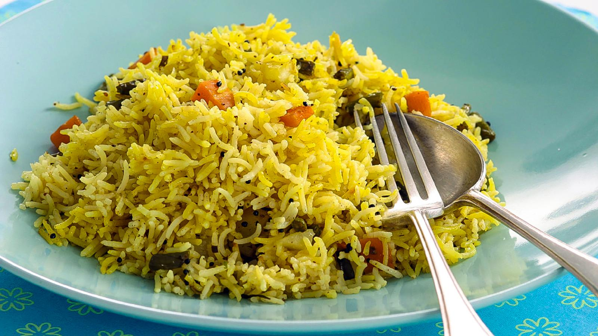

# Pilau Rice

*A fragrant rice perfumed with saffron, cardamom, cinnamon, and cumin. Gentle ghee carries the aromatics into every grain of basmati rice. A 40-minute rest allows the rice to cook perfectly from residual steam.*

**Serves:** 4

## Overview
This is Indian rice cooking at its most elegant. Whole spices bloom in hot ghee, releasing their essential oils. The rice toasts lightly in this fragrant fat before being simmered gently under a tight lid. A final infusion of saffron-scented milk adds color and subtle flavor. Each grain remains separate and al dente, never mushy.

## Ingredients

### Rice & Saffron
- 370 grams (2 cups) basmati rice
- 3 tablespoons whole milk
- Pinch of saffron threads

### Aromatics & Oil
- 3 tablespoons ghee
- 6 green cardamom pods (lightly bruised)
- 5 cm piece of cinnamon stick or cassia bark
- 1 teaspoon cumin seeds
- 1 onion (finely chopped)
- 1 garlic clove (smashed)
- 2 Indian bay leaves

### Cooking Liquid
- 750 ml cold water or unsalted chicken stock
- Salt to taste 

## Method
1. Rinse and soak the rice. 
1. While it is soaking, heat the milk in a small pan until it begins to simmer. 
1. Take off the heat and stir in the saffron. 
1. Leave to infuse for about 15 minutes. 
1. Melt the ghee over a medium high-heat in a saucepan that has a tight-fitting lid. 
1. When good and hot and beginning give off a nutty aroma, toss in the whole spices and cook for about 30 seconds until they become fragrant. 
1. Add the onion and sizzle for about 5 minutes until it is translucent and soft. 
1. Add the garlic to the pan, followed by the drained rice. 
1. Stir this all up so that the rice is evenly coated in the ghee. 
1. Pour in the water or stock, add the bay leaves, then cover the pan. 
1. When the rice begins to boil and the water foams, remove from the heat and let it sit, covered and undisturbed for 40 minutes. 
1. After 40 minutes, lift the lid and pour the saffron milk mixture over the top. 
1. Carefully stir through the rice using a fork or chopstick, until the grains of rice are nice and fluffy. 
1. Don’t stir too vigorously as basmati rice has a tendency to split. 
1. Season with salt to taste and transfer to a warm bowl to serve. 
