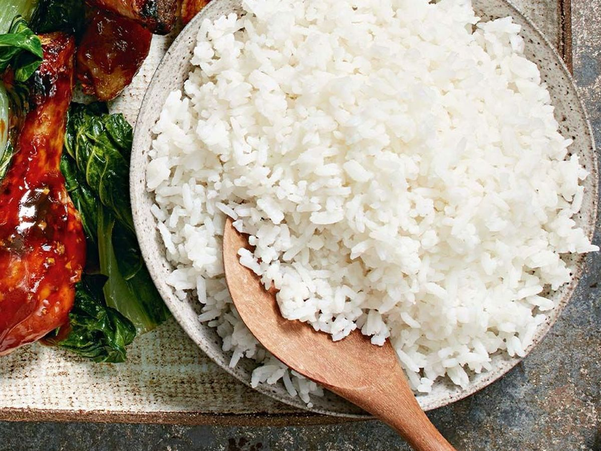

# Steamed Rice

*This is the simplest and purest form of rice preparation: rinsed basmati, briefly cooked, then rested undisturbed. The result is separate, tender grains, the foundation rice for any curry.*

**Serves:** 4

## Overview
Basic steamed rice is deceptively important. This method produces separate, tender grains with no mushiness or stickiness. The technique is simple: bring to boil, immediately remove from heat, and rest undisturbed for 40 minutes. The key is discipline, don't lift the lid during resting. Ghee adds richness and flavor. This is the ideal rice for pairing with any curry, dal, or Indian preparation. Master this technique and you've mastered rice cooking.

## Ingredients

### Rice & Liquid
- 370 grams (2 cups) basmati rice
- 750 ml (3 cups) cold water
- Pinch of fine sea salt

### Fat & Finishing
- 1 tablespoon ghee (clarified butter) or unsalted butter

## Method

### Stage 1 – Rinse Rice
1. Place the basmati rice in a large bowl or sieve.
1. Rinse under cold running water, stirring gently with your fingers for 30-45 seconds.
1. Continue rinsing until the water runs almost clear (this removes excess starch).
1. Drain thoroughly; the rice should be damp but not pooling with water.

### Stage 2 – Combine Ingredients
1. Place the rinsed, drained rice in a saucepan with a tight-fitting lid.
1. Add the cold water.
1. Add the pinch of salt.
1. Add the ghee or butter.
1. Stir once to distribute the salt and ghee.
1. **Important:** Never fill the pan more than one-third full; if making a larger batch, cook in two batches. Overcrowding prevents proper steaming.

### Stage 3 – Bring to Boil
1. Cover the saucepan with its tight-fitting lid.
1. Place over high heat.
1. Bring to a rolling boil (you'll hear it bubbling vigorously and see steam escaping).
1. This takes approximately 8-12 minutes depending on the pan and heat source.

### Stage 4 – Remove from Heat & Rest (Critical Step)
1. As soon as the water boils, remove the saucepan from the heat immediately.
1. **Do not remove the lid.**
1. Leave the covered saucepan undisturbed for exactly 40 minutes.
1. **Do not peek.** Each time you lift the lid, heat and steam escape, disrupting the cooking process.
1. Set a timer if you tend to be impatient; this rest is what creates perfectly separated, tender grains.

### Stage 5 – Fluff & Serve
1. After 40 minutes, carefully remove the lid (watch for escaping steam).
1. Using only a fork or chopstick, gently separate the rice grains.
1. Use upward, separating strokes, never vigorous stirring.
1. Basmati rice has a tendency to turn to mush if handled roughly; treat it gently.
1. Transfer to a warm serving bowl.
1. Serve immediately while warm.

## Notes
- **Lid Discipline:** This is absolutely critical. The sealed environment creates the steam that cooks the rice perfectly. Opening the lid releases this steam and ruins the result.
- **Basmati Only:** This method works best with basmati rice. Other long-grain varieties may require slight adjustments.
- **Water Ratio:** The ratio is 1 part rice to 2 parts water by volume (not weight). If you're doubling the recipe, use 1.5 cups water per 1 cup rice.
- **Pan Size:** A pan that's no more than one-third full ensures the rice cooks evenly. A too-full pan creates uncooked rice at the bottom.
- **Cold Water:** Starting with cold water prevents the rice from becoming mushy; hot water can overcook it.
- **Ghee vs. Butter:** Ghee (clarified butter) adds richness and nuttiness; butter works but adds slight water that can overcook rice. Ghee is preferred.
- **Fork or Chopstick:** Using these allows gentle separation; a spoon crushes and breaks the grains.

## Variations
**with Lemon:** Squeeze fresh lime or lemon juice over the finished rice and add zest for brightness.
**Aromatic Oil:** Drizzle with aromatic oil infused with cumin seeds or bay leaf instead of plain ghee.
**Coconut Water:** Replace some cold water with unsweetened coconut water for subtle, sweet flavor.
**Spice-Scented:** Toast a pinch of cumin seeds and 1 bay leaf in ghee, then add rice and water as directed.
**Herb-Infused:** Add 2-3 crushed cardamom pods or 1 cinnamon stick to the water before cooking.

## Serving
Serve with: Any curry, dal, tandoori proteins, pickles, raita
Temperature: Serve hot, immediately after fluffing
Amount: Approximately 200g (1 cup cooked) per person
Garnish: Fresh coriander leaves, fried onions, or sliced fresh chilli

## Storage
- Refrigerate leftover cooked rice in an airtight container for up to 3 days
- Reheat gently in a saucepan with 2-3 tablespoons water and a small knob of ghee; don't use microwave (rice becomes rubbery)
- Do not freeze; the delicate basmati texture becomes grainy or mushy
- Best served fresh and warm; reheated rice is acceptable but lacks the freshness of newly cooked rice