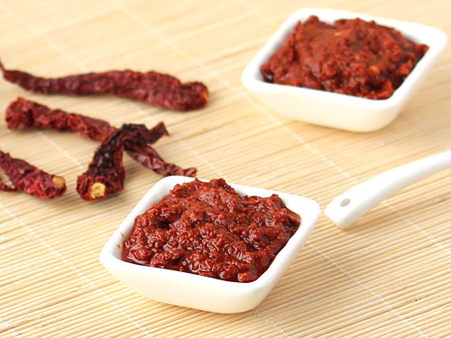

# Kashmiri Red Chilli and Garlic Chutney

*This is a powerful chutney, full of flavor and heat. Dried Kashmiri chillies provide deep, fruity heat without excessive burn. Garlic adds pungency; toasting both ingredients before blending develops complexity.*

**Yield:** Approximately 300 ml (serves 4-6)

## Overview
This is a minimal-ingredient chutney that relies on quality ingredients and proper technique. Kashmiri chillies are prized for their fruity, sweet heat; they're less aggressive than other dried red chillies. Garlic adds pungency and depth. Toasting the chillies before soaking awakens their essential oils. The soaking liquid becomes part of the chutney, adding its flavor to the final product. This is a versatile condiment, serve with pakora, samosa, or alongside curries.

## Ingredients

### Main Elements
- 20 Kashmiri dried red chillies
- 10 garlic cloves (peeled and smashed)

### Spices & Seasoning
- 1/2 teaspoon ground cumin
- 1/4 teaspoon fine sea salt (or to taste)

### For Soaking
- Hot water from kettle (approximately 200 ml)

## Method

### Stage 1 – Prepare Chillies
1. Split the dried chillies open lengthwise.
1. Using your fingers, remove as many seeds as you can.
1. **Note:** There's no need to remove all seeds; those remaining will sink to the bottom as you soak and can be left behind.

### Stage 2 – Toast Chillies
1. Heat a dry frying pan over medium heat for 1 minute.
1. Add the de-seeded chillies to the hot pan.
1. Press them down firmly with the heel of your hand so they are evenly toasted.
1. Toast for about 1 minute, stirring occasionally.
1. The chillies should smell fragrant and slightly smoky; don't let them scorch.
1. Remove from heat immediately.

### Stage 3 – Soak
1. Tip the toasted chillies into a bowl.
1. Pour hot water from the kettle to cover them (approximately 200 ml).
1. Leave to soak for 30 minutes.
1. The chillies will soften and the soaking liquid will take on their color and flavor.

### Stage 4 – Blend to Chutney
1. Strain the chillies, reserving the soaking water in a separate bowl.
1. Taste the soaking water: if it tastes slightly bitter, it's still usable; if intensely bitter, discard and use fresh water instead.
1. Place the soaked chillies in a spice grinder or food processor.
1. Add the smashed garlic cloves, ground cumin, and salt.
1. Add just enough of the soaking water (or fresh water if needed) to blend the mixture to a smooth, ketchup-like consistency.
1. Blend until completely smooth, scraping down the sides as needed.
1. Taste and adjust seasoning with additional salt if needed.

### Stage 5 – Finish
1. The chutney is ready to serve immediately.
1. No cooking is needed; this is a raw, fresh chutney.
1. Transfer to a serving bowl or sterilized jar for storage.

## Notes
- **Kashmiri Chillies:** These are milder and fruity compared to other dried red chillies; don't substitute with Thai bird's eye or other hot varieties, as the flavor will be entirely different.
- **Toasting:** This step awakens the essential oils and adds depth; don't skip it.
- **Soaking Water:** The soaking liquid becomes part of the chutney's body; it's flavorful and shouldn't be wasted. Taste it to judge its bitterness.
- **Consistency:** Ketchup-like means pourable yet thick enough to cling to food; adjust water as needed.
- **Fresh Garlic:** The raw garlic should remain noticeably pungent; this is intentional and provides sharpness.

## Variations
**Milder Heat:** Remove more seeds from the chillies, or use 15 chillies instead of 20.
**Extra Heat:** Add 1/4 teaspoon cayenne powder to push the spice level further.
**With Coriander Seed:** Toast 1/4 teaspoon coriander seeds with the chillies for additional aromatic depth.
**Add Ginger:** Include 1 teaspoon ginger paste for warmth and complexity.
**Smoother Texture:** Blend longer for a completely smooth, sauce-like consistency.

## Serving
Serve with: Pakora, samosa, bhajias, chaat, curries
Amount: 1-2 tablespoons per serving
Temperature: Serve at room temperature or chilled
Garnish: Fresh coriander leaves (optional)

## Storage
- Refrigerate in a covered glass jar for up to 5 days
- The fresh garlic and chillies are perishable; use within 1 week maximum
- Do not freeze; the texture becomes separated and grainy
- Best served fresh within 2-3 days of making