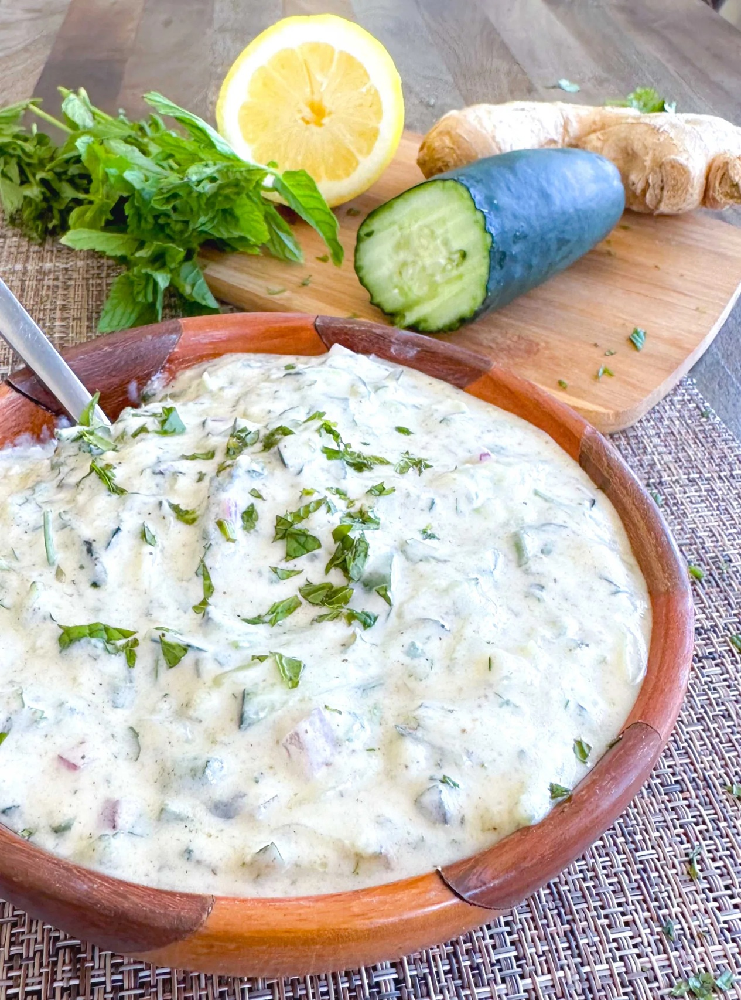

# Cucumber Raita

*Cucumber raita is a wonderfully refreshing accompaniment that cools and soothes the palate after spicy curries. Cool yoghurt suspends delicate diced cucumber and green chilli for a dish that's as simple as it is essential at the Indian table.*

**Serves:** 4

## Overview
This is the most essential Indian yoghurt-based side dish. Cooling yoghurt, refreshing cucumber, and a hint of heat from green chilli create a balance that's perfect alongside any spiced main course. The technique is simple: dice cucumber finely, fold into yoghurt with minimal seasonings, and garnish. This is a template raita; it anchors the Indian meal.

## Ingredients
- 1 medium cucumber
- 300 ml natural yoghurt (preferably plain, full-fat)
- 1/4 teaspoon salt
- 1/4 teaspoon ground cumin
- 1 fresh green chilli (de-seeded and chopped very finely)
- Pinch of chilli powder (for dusting)
- 1 fresh mint sprig (for garnish)

## Method

### Stage 1 – Prepare Cucumber
1. Slice the cucumber in half lengthwise.
2. Slice each half into quarters lengthwise, creating four long spears.
3. Using a knife, carefully discard the seed-filled center of each spear.
4. Dice the remaining cucumber flesh very finely into small cubes.
5. Place diced cucumber on paper towels to drain excess moisture.

### Stage 2 – Mix Raita
1. Place the yoghurt in a serving bowl.
2. Add the drained diced cucumber.
3. Add the salt, ground cumin, and finely chopped green chilli.
4. Fold everything together very gently, stirring just until combined.
5. Do not overmix; the raita should be light and airy.

### Stage 3 – Finish & Chill
1. Transfer to a serving bowl if not already there.
2. Dust lightly with chilli powder.
3. Top with a fresh mint sprig.
4. Cover and refrigerate until serving time.

## Notes
- **Yoghurt Quality:** Use natural, unsweetened yoghurt (Greek yoghurt works well); sweetened yoghurt ruins the balance.
- **Cucumber Prep:** Removing seeds prevents the raita from becoming watery; moisture is the enemy.
- **Gentle Mixing:** Overmixing breaks down the yoghurt's delicate texture.
- **Chill Before Serving:** Cold raita is far more refreshing and effective at cooling the palate.
- **Timing:** Make this shortly before serving; it's best fresh.

## Variations
**With Mint:** Add 1 tablespoon fresh chopped mint to the yoghurt base.
**Tomato Raita:** Substitute or add 1 medium tomato (de-seeded and diced) for part of the cucumber.
**Beet Raita:** Add 1/2 medium beet (finely grated) for color and earthiness.
**Garlic Version:** Add 1 crushed garlic clove for pungent depth.

## Serving
Serve with: Any curry, biryani, tandoori dishes, as a cooling accompaniment
Garnish with: Fresh mint sprig, dusted chilli powder, cumin seeds

## Storage
- Best served fresh, within 1-2 hours of preparation
- Refrigerate in a covered container for up to 1 day
- Do not freeze; yoghurt texture becomes grainy when thawed