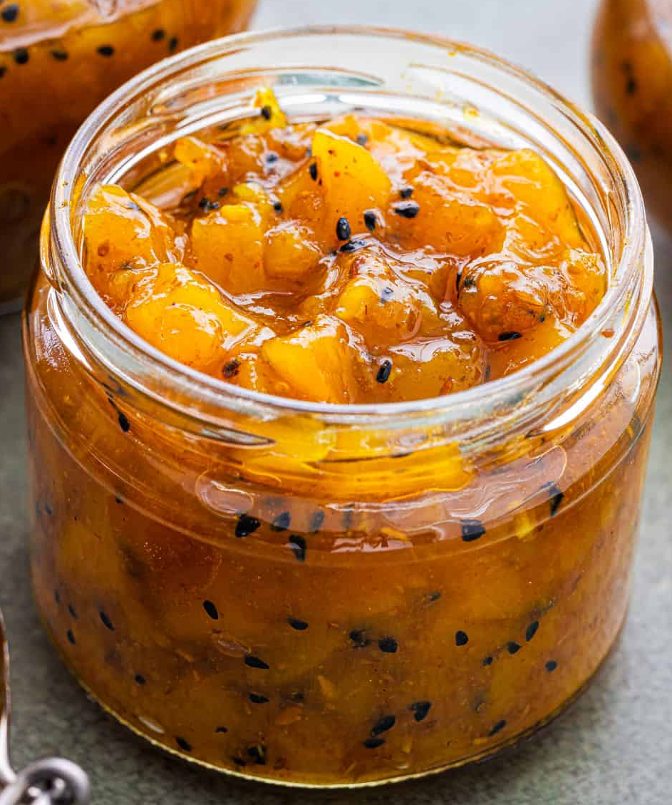

# Mango Chutney

*Mango chutney is easy to prepare and endlessly adaptable to taste preferences. Sweet, tangy, and optional spicy, this is the chutney most familiar to Western Indian restaurants. Green (unripe) mangoes provide tartness; sugar and vinegar provide balance. Serve chunky or blended smooth depending on preference.*

**Yield:** Approximately 600 ml (2-3 jars)

## Overview
This is the foundational chutney of Indian kitchens. Unripe green mangoes, simmered slowly with sugar and vinegar in a gentle spice base, transformed into a thick, concentrated condiment. The sweet and sour balance allows the mango's subtle character to shine. This is shelf-stable and improves with age; make it in batches and keep jars on hand year-round.

## Ingredients

### Base
- 400 grams sugar
- 250 ml distilled white vinegar
- 4-5 green mangoes (peeled and cubed)
- 1 onion (chopped)
- Large handful of raisins (about 75 grams)

### Aromatics & Spices
- 5 cm piece of fresh ginger (peeled and finely chopped)
- 3 garlic cloves (finely chopped)
- 1 teaspoon black mustard seeds
- 1 teaspoon chilli powder (optional, add if desired spice)
- Salt (optional, to taste)

## Method

### Stage 1 – Create Base Syrup
1. Place the sugar and vinegar in a large, heavy-bottomed saucepan.
2. Bring to a boil over medium-high heat.
3. Stir continuously until the sugar dissolves completely.
4. The mixture should be clear and bubbling gently.

### Stage 2 – Build Chutney
1. Add the cubed green mangoes to the syrup.
2. Add the chopped onion and raisins.
3. Add the finely chopped ginger and garlic.
4. Stir in the black mustard seeds (and chilli powder if using).
5. Stir everything together until well combined.

### Stage 3 – Long Simmer
1. Reduce the heat to low.
2. Simmer gently and stirring regularly, for about 1 hour (or until the mixture is very thick and sticky).
3. The mango pieces should break down and soften.
4. The syrup should reduce significantly and coat the back of a spoon.
5. The chutney is ready when it reaches a jam-like consistency.

### Stage 4 – Finish & Preserve
1. When the chutney reaches desired thickness, taste and adjust seasonings (add salt if needed).
2. For chunky chutney, leave as is; for smooth, blend until desired consistency.
3. Transfer to hot, sterilized jars while still hot.
4. Leave a little space at the top (about 1 cm).
5. Allow to cool to room temperature before sealing.

## Notes
- **Green Mangoes:** Unripe mangoes are essential; they provide the tartness that balanced ripe mangoes lack. Sourced from Indian grocers.
- **Thick Consistency:** The 1-hour simmer creates the signature thick texture; don't rush this stage. If too thin, continue simmering; if too thick, thin with a splash of vinegar.
- **Sterilization:** Always use sterilized jars for proper preservation; wash and boil jars before use.
- **Sweetness Balance:** This chutney is sweet; if you prefer less sweetness, reduce sugar by 50 grams and add extra vinegar.
- **Spice Adjustment:** Chilli powder is optional; add it only if you want heat.

## Variations
**Spicy Heat:** Add 1-2 teaspoons chilli powder for more pronounced heat.
**With Turmeric:** Add 1/2 teaspoon ground turmeric for earthiness and color.
**Mint Version:** Add 1/4 cup fresh chopped mint in the last 5 minutes of cooking.
**Smooth Texture:** Blend until completely smooth for a refined consistency.

## Serving
Serve with: Samosas, pakora, rotis, curries, cheeses
Garnish: None needed; this is a condiment

## Storage
- Store in sterilized glass jars with tight-fitting lids
- The high sugar and vinegar content preserves the chutney; properly sealed jars keep for 6+ months
- Once opened, refrigerate for up to 2-3 weeks
- Flavors improve and deepen after 1-2 weeks of storage 

