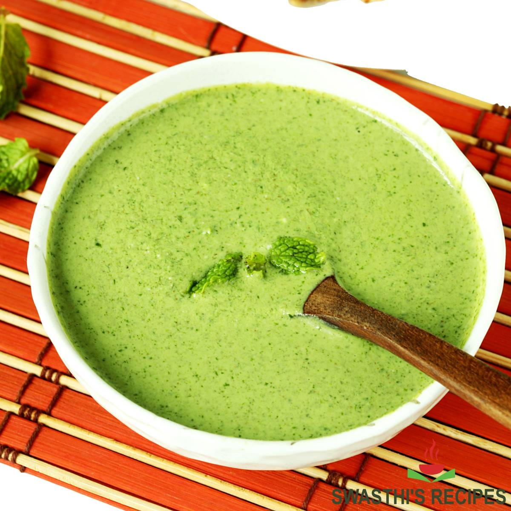

# Mint Chutney

*This is probably the most popular chutney served in Indian restaurants. A simple blend of yoghurt, mint, garlic, ginger, and green chilli creates a fresh, cooling condiment that's essential at the table. Smooth, creamy, and subtly spiced, this is the foundation chutney.*

**Serves:** 4-6

## Overview
Mint chutney is the Indian restaurant staple for good reason. A bright green blend of fresh yoghurt, mint leaves, and aromatics creates a versatile condiment that soothes and refreshes. Unlike many chutneys that are cooked, this one is assembled fresh and chilled, maintaining the mint's vibrant character. Quick to prepare, it lasts several days refrigerated.

## Ingredients
- 270 grams plain yoghurt (full-fat preferred)
- 1 tablespoon garlic and ginger paste
- 1-3 bird's-eye green chillies (finely chopped)
- Juice of 1 fresh lime
- 1-2 tablespoons commercial mint sauce (or fresh mint leaves blended)
- Pinch of salt

## Method

### Stage 1 – Combine Ingredients
1. Place the yoghurt in a mixing bowl.
2. Add the garlic and ginger paste.
3. Add the finely chopped green chillies (quantity depends on heat preference).
4. Add the lime juice.
5. Stir in the mint sauce (or freshly blended mint leaves).
6. Add just a pinch of salt to heighten flavors without oversalting.

### Stage 2 – Blend Smooth
1. Whisk all ingredients together vigorously until completely smooth and well combined.
2. Use a hand whisk or blender for completely smooth consistency.
3. The chutney should be creamy and pourable, not thick.

### Stage 3 – Chill & Serve
1. Cover the bowl with plastic wrap or a tight-fitting lid.
2. Place in the refrigerator for at least 30 minutes before serving.
3. This resting time allows flavors to marry and the chutney to chill properly.
4. Serve cold or chilled.

## Notes
- **Yoghurt Quality:** Use plain, unsweetened, full-fat yoghurt; sweetened or low-fat versions compromise the classic taste.
- **Heat Level:** Adjust green chillies to your preference; more chillies for serious heat, fewer for mild chill.
- **Mint Sauce:** Most Indian cooks use commercial mint sauce (like Colman's) for consistency; fresh mint can be substituted but provides different flavor.
- **Lime Essential:** The lime juice provides brightness and prevents flavors from becoming flat.
- **Chill Time:** Don't skip the refrigeration; cold chutney is far more refreshing.

## Variations
**With Fresh Mint:** Replace commercial mint sauce with 3 tablespoons fresh mint leaves blended with the other ingredients.
**Coriander Version:** Add 1 tablespoon fresh coriander leaves for additional herbal depth.
**Cumin Addition:** Add 1/4 teaspoon toasted ground cumin for earthiness.
**Garlic Emphasis:** Use 2 tablespoons of garlic paste instead of combined garlic-ginger for more punch.

## Serving
Serve with: Samosas, pakora, tandoori dishes, curries, rotis
Garnish: Fresh mint sprig, squeeze of lime

## Storage
- Refrigerate in a covered container for up to 4 days
- Do not freeze; yoghurt texture becomes grainy
- Always use a clean spoon to prevent contamination