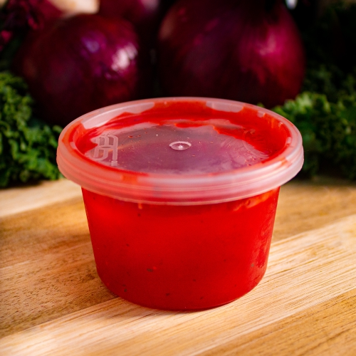

# Pakora Sauce

*Usually this sweet-and-sour sauce is red from food coloring, and it does look the part when bright red. The mango chutney and ketchup are already quite sweet but you might want to add a little sugar. The sour flavours come from the lemon and mint sauce. This is customizable to taste preferences.*

**Yield:** Approximately 400 ml

## Overview
This is the quintessential dipping sauce for pakora and bhajis at Indian restaurants. A blend of yoghurt, mango chutney, tomato ketchup, and mint sauce creates a balanced sweet-sour-creamy condiment. The optional red food coloring gives it restaurant-style appearance, though it's not necessary. This sauce is quick to assemble and improves with a brief chill.

## Ingredients

### Base
- 200 grams (about 1 cup) plain yoghurt
- 2 tablespoons smooth mango chutney
- 3 tablespoons tomato ketchup
- 1 teaspoon mint sauce (preferably commercial)
- 1/2 teaspoon roasted cumin seeds
- 1/2 teaspoon chilli powder (or to taste)

### Sweetness & Sourness
- 1 tablespoon sugar (optional, adjust to taste)
- Fresh lemon juice (to taste)

### Finishing
- 1 onion (finely chopped, optional)
- 1 teaspoon red food coloring powder (optional)
- Milk (optional, to adjust consistency)
- Salt to taste

## Method

### Stage 1 – Assemble Base Sauce
1. Place the plain yoghurt in a mixing bowl.
2. Add the smooth mango chutney.
3. Add the tomato ketchup.
4. Add the mint sauce.
5. Stir everything together until well combined and smooth.

### Stage 2 – Add Seasonings & Balance
1. Stir in the roasted cumin seeds.
2. Add the chilli powder.
3. Add the sugar (if desired; this is optional and depends on preference).
4. Add fresh lemon juice to taste, starting with 1 tablespoon (the lemon brightens and balances).
5. Taste and adjust sweetness, sourness, and heat to your preference.

### Stage 3 – Add Vegetables & Color (Optional)
1. If using, fold in the finely chopped onion for texture and bite.
2. If using, add the red food coloring powder and stir until evenly colored.
3. If the sauce is too thick, thin with milk (add 1 tablespoon at a time) until you reach desired consistency.

### Stage 4 – Finish & Chill
1. Season with salt to taste.
2. Transfer to a serving bowl.
3. Cover and refrigerate until serving.
4. The sauce is better served chilled.

## Notes
- **Sweet-Sour Balance:** This sauce should be sweet with hints of sour. If too sweet, add lemon juice; if too sour, add a touch more mango chutney.
- **Food Coloring:** Completely optional; the sauce is delicious without it. Use only if you like the classic restaurant appearance.
- **Sugar Optional:** Some prefer the sauce without added sugar; the chutney and ketchup provide sweetness already.
- **Yoghurt Quality:** Use plain, unsweetened yoghurt; sweetened varieties ruin the balance.
- **Onion Texture:** Adding finely chopped fresh onion provides texture and crispness; it's optional but recommended.

## Variations
**Spicier Heat:** Add 1 additional teaspoon chilli powder for pronounced spice.
**With Ginger:** Add 1 teaspoon ginger paste for warmth and depth.
**Fresh Coriander:** Stir in 1 tablespoon fresh chopped coriander just before serving.
**Lighter Version:** Substitute half-yoghurt with sour cream for a tangier sauce.

## Serving
Serve with: Pakora, bhajis, samosas, spring rolls, fried appetizers
Garnish: None needed; this is a condiment

## Storage
- Refrigerate in a covered container for up to 3 days
- Best served chilled
- Do not freeze; yoghurt texture becomes grainy
- Always use a clean spoon to prevent contamination 
