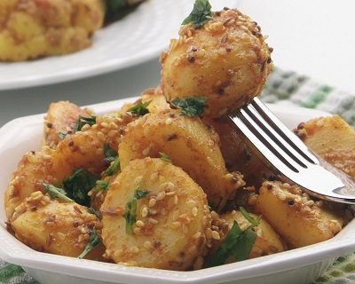

# Bombay Potatoes

*This classic Indian vegetarian dish of potatoes is slow cooked in a richly flavoured curry sauce with fresh chillies for an added kick.*

**Serves:** 4-6

## Overview
Bombay Potatoes is comfort food at its finest. Small potatoes are partially cooked, then coated in a richly spiced oil infused with seeds and aromatics. Some potatoes are mashed to create a creamy base, while others remain whole for texture. The result is a warm, golden, deeply spiced side dish that's utterly satisfying. This is a vegetarian staple of Indian home cooking.

## Ingredients

### Potatoes
- 450 grams new potatoes

### Oil & Seeds (Tempering)
- 4 tablespoons vegetable oil
- ½ teaspoon black mustard seeds
- ½ teaspoon onion seeds
- 2 dried red chillies
- 6 curry leaves

### Aromatics & Spices
- 2 onions (finely chopped)
- 2 fresh green chillies (finely chopped)
- 1 teaspoon ground turmeric
- ¼ teaspoon asafoetida
- ½ teaspoon cumin seeds
- ½ teaspoon fennel seeds
- ½ teaspoon kalonji seeds

### Fresh & Finish
- 50 grams fresh coriander leaves (chopped)
- Lemon juice (to taste)
- Salt
- Fried fresh curry leaves (to garnish)
- Sesame seeds (to garnish)

## Method

### Stage 1 – Cook Potatoes
1. Chop the potatoes into small chunks.
1. Bring a pan of lightly salted water to the boil and add the potatoes with half the turmeric.
1. Cook for 15-20 minutes, or until tender.
1. Drain and set aside a few potatoes for texture; coarsely mash the rest.

### Stage 2 – Temper Seeds & Aromatics
1. Heat the oil in a large heavy pan over medium-high heat.
1. Add the dried red chillies and curry leaves, frying until the chillies begin to char but before they burn.
1. Immediately add the black mustard seeds, onion seeds, and fennel seeds; stir briefly as they pop (about 30 seconds).
1. Add the kalonji seeds.

### Stage 3 – Add Onions & Spices
1. Add the finely chopped onions and fresh green chillies to the spiced oil.
1. Add the remaining turmeric, asafoetida, and cumin seeds.
1. Cook the spices, stirring constantly until the onions are tender and golden (about 5 minutes).
1. Add the fresh coriander leaves.

### Stage 4 – Finish & Incorporate Potatoes
1. Fold in both the mashed and whole potatoes, stirring gently.
1. Add a few drops of water to create a light sauce.
1. Cook over low heat for 10 minutes, stirring gently so that the potatoes absorb the spices without breaking up.
1. Season with salt and lemon juice to taste.
1. Transfer to a warm serving dish.

## Notes
- **Spice Tempering:** The brief toasting of whole seeds releases their essential oils; this is the foundation of the dish's flavor.
- **Potato Texture:** The combination of mashed and whole potatoes creates creamy pockets and hearty chunks; don't over-mash.
- **Gentle Stirring:** Handle potatoes carefully in the final stages to preserve texture; rough stirring destroys the dish.
- **Curry Leaf & Chilli:** These burn easily; watch carefully during tempering.
- **Asafoetida:** This digestive spice is essential; use sparingly, as it's pungent.

## Variations
**With Green Peas:** Add 75g frozen peas in the final 5 minutes of cooking.
**Spicier Heat:** Use 3 fresh green chillies instead of 2.
**Extra Mustard:** Double the mustard seeds for pronounced nutty flavor.
**Tomato Addition:** Add 1 medium tomato (diced) after the onions are golden.

## Serving
Serve with: Rice, breads (roti, naan), dals, curries
Garnish: Reserved fried curry leaves and sesame seeds
Vessels: Serve at the table in a warm bowl

## Storage
- Refrigerate in a covered container for up to 3 days
- Reheat gently in a pan with a splash of water
- Flavor improves slightly the next day as spices marry
- Do not freeze; potato texture becomes mealy