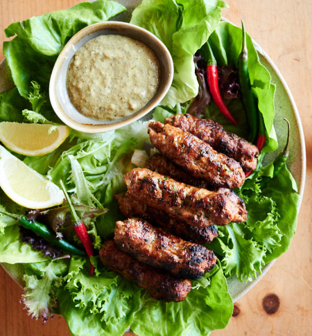

# Lamb Seekh Kebab

*Seekh kebab is minced meat moulded onto a metal skewer and charred over a barbecue. The meat is fine-textured from extensive kneading, which develops a "lace" texture when charred.*

**Serves:** 4 (makes approximately 8 kebabs)

## Overview
Seekh kebab is restaurant-quality barbecue. Unlike simple meatballs, seekh kebab is defined by its fine, dense, bound texture achieved through vigorous kneading. The spice profile is warm and aromatic without aggression. When charred over hot coals, the exterior develops a smoky, charred, visible "lace" pattern while the interior stays succulent. This is elegant Indian street food made at home, served with yoghurt and lemon.

## Ingredients

### Meat & Base
- 1kg lean minced lamb
- 2 onions (finely chopped)
- 2 tablespoons finely chopped green chillies
- 1 egg

### Spices & Aromatics
- 1 tablespoon freshly roasted ground coriander
- 1 tablespoon garam masala
- Large bunch of fresh coriander (finely chopped)
- 1 teaspoon salt
- Black pepper to taste

### For Cooking & Serving
- Oil for basting
- Lemon wedges

## Method

### Stage 1 – Mix & Knead Mixture
1. Place the lamb mince in a large bowl.
1. Mix in the finely chopped onions, green chillies, and egg.
1. Add the ground coriander, garam masala, and fresh chopped coriander.
1. Season with salt and black pepper.
1. Mix all ingredients thoroughly.
1. **Critical step:** Begin kneading the mixture with your hands.
1. When all the ingredients are nicely mixed, begin pressing down on the meat, scraping it against the bottom of the bowl.
1. The meat should streak against the bottom of the bowl, giving a "lace" texture pattern.
1. This will take about 5 minutes of vigorous kneading.
1. The mixture should feel uniform, sticky, and bound.

### Stage 2 – Mould onto Skewers
1. Form the mixture into meatballs the size of tennis balls.
1. Slide a meatball onto a large, flat skewer and squeeze with a wet hand into a sausage shape around the skewer.
1. Turn the skewer over and do the same, squeezing again with your hand to make it longer and more refined.
1. Continue this process until you have a long kebab with visible finger marks that is securely on the skewer.
1. Repeat with the rest of the meat mixture.
1. Chill the molded kebabs on a tray for at least 30 minutes to firm up.

### Stage 3 – Preheat & Cook
1. Heat your barbecue using the direct heat method (charcoal or gas), ensuring grates are very clean.
1. Lightly oil the skewers and grates to prevent sticking.
1. Place the kebabs over the hot heat.

### Stage 4 – Char & Finish
1. Char well on one side (about 6-7 minutes), rotating gently.
1. Flip them over and do the same on the other side (another 6-7 minutes).
1. **Key:** The exterior should develop a dark, charred "lace" pattern while the interior remains pink (lamb is best medium-hot).
1. Baste frequently with oil to prevent drying.
1. The kebabs are done when charred and a skewer inserted into the meat meets no resistance.
1. Transfer to a warm serving plate.
1. Rest for 5 minutes before serving.

## Notes
- **Kneading is Essential:** This vigorous mixing creates the signature fine, dense texture and the visible "lace" pattern when charred. Proper kneading transforms mince into something entirely different.
- **Finger Marks:** These are intentional visual markers; they help the kebab cook evenly and show the kneading was done properly.
- **Wet Hands:** Keep hands wet during molding; this prevents sticking and helps compress the meat.
- **Charring:** The dark, charred surface is not burning; it's the Maillard reaction creating depth and smokiness. Embrace it.
- **Doneness:** Lamb medium is 65°C internal; use a meat thermometer in the thickest part.
- **Metal Skewers:** These conduct heat; avoid wooden skewers, which can burn. Flat skewers hold meat better than round ones.

## Variations
**Spicier Heat:** Increase green chillies to 3-4 or add 1/2 teaspoon chilli powder.
**With Pomegranate:** Mix in 2-3 tablespoons pomegranate seeds after kneading for sweetness and moisture.
**Minced Chicken:** Substitute chicken mince for lamb; reduce cooking time to 10-12 minutes (chicken dries faster).
**Extra Herbs:** Include 1 tablespoon fresh mint leaves or add 1/4 teaspoon asafoetida.

## Serving
Serve with: Rice pilau, breads (naan, rotis), raita
Garnish: Fresh coriander, lemon wedges, thinly sliced red onion
Accompaniments: Yoghurt, lemon juice, fresh mint

## Storage
- Refrigerate molded raw kebabs on a tray for up to 24 hours (covered)
- Cooked kebabs refrigerate for 2 days; reheat in oven at 160°C for 10 minutes
- Freeze raw molded kebabs on a tray, then transfer to a bag for up to 3 months; cook directly from frozen (add 2-3 minutes to cooking time)
- Do not re-freeze cooked kebabs
