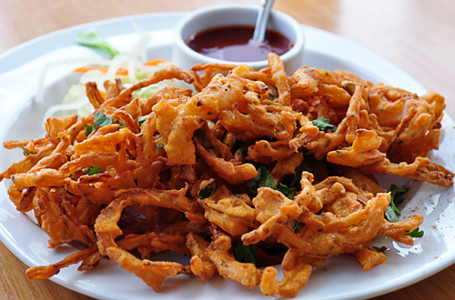

# Onion Bhajis

*A popular accompaniment to a takeaway curry, onion bhajis are irresistible. When they are freshly made and served with cucumber and yoghurt relish, they make the perfect vegetarian snack food.*

**Yield:** 15 bhajis (serves 4)

## Overview
Onion bhajis are the simplest fritters yet utterly addictive. Thinly sliced onions are coated in a spiced chickpea flour batter, then briefly deep-fried until golden and crispy. They're light and delicate, with an irresistible crispness that shatters between your teeth. Serve immediately while hot and crunchy, accompanied by chutney or yoghurt relish. This is takeaway food at its finest, made fresh at home.

## Ingredients

### Batter Base
- 250 grams gram (chickpea) flour
- 1 teaspoon chilli powder
- 1 teaspoon ground turmeric
- 1 teaspoon coriander seeds (crushed)
- Salt to taste

### Fresh Elements & Vegetables
- 3 large onions (sliced thinly)
- 6 fresh curry leaves

### For Cooking
- Water (gradually added to form batter)
- Sunflower oil (for deep frying)

## Method

### Stage 1 – Prepare Batter
1. Combine the gram flour, chilli powder, turmeric, crushed coriander seeds, and a pinch of salt in a bowl.
1. Gradually add water to make a thick batter that will hold the onions together.
1. The batter should be thick enough to coat the onions without dripping off (more like pancake batter than crepe batter).

### Stage 2 – Coat Vegetables
1. Mix the thinly sliced onions and curry leaves into the prepared batter.
1. Stir gently until every onion slice is coated.
1. Let the mixture rest for 5 minutes.

### Stage 3 – Heat Oil & Begin Frying
1. Fill a heavy-based saucepan one-third full with sunflower oil.
1. Heat the oil to 180°C (a cube of bread should brown in 40 seconds).
1. **Critical:** Oil temperature is essential; too cool creates greasy, soggy bhajis; too hot and they burn outside before cooking inside.

### Stage 4 – Fry & Drain
1. Take two spoonfuls of the onion batter and carefully lower them into the hot oil in batches.
1. Do not overcrowd the pan; each bhaji needs space to cook evenly.
1. Deep fry for 1-2 minutes, turning occasionally, until golden all over and cooked through.
1. Remove with a slotted spoon and place on kitchen paper.
1. Sprinkle with salt while still hot.
1. **Important:** Serve immediately while crispy; they lose crispness quickly.

## Notes
- **Oil Temperature:** Use a thermometer; 180°C is optimal. Bhajis must fry quickly to avoid absorbing oil.
- **Batter Consistency:** Too thin and bhajis won't coat; too thick and they're clumpy. Get this right.
- **Curry Leaves:** These add essential flavor and visual appeal; don't omit.
- **Onion Thickness:** Slicing uniformly ensures even cooking; avoid thin shreds that burn.
- **Fresh Frying:** Bhajis are best within minutes of cooking; every minute they sit, crispness degrades.
- **Batch Size:** Two spoonfuls per bhaji is ideal; larger portions cook unevenly.

## Variations
**Spicier Heat:** Increase chilli powder to 1.5 teaspoons or add 1/2 teaspoon chilli powder.
**Spinach Bhajis:** Substitute 2 cups fresh spinach (chopped) for half the onion; reduce oil temperature to 170°C (spinach burns easily).
**Herb Emphasis:** Include 1 tablespoon fresh mint leaves for additional fragrance.
**Cauliflower Mix:** Replace half the onion with finely chopped raw cauliflower florets.

## Serving
Serve with: Instant chutneys, yoghurt relish, cucumber raita, tamarind sauce
Accompaniments: Lemon wedges, fresh mint
Vessels: Serve on a warm plate lined with kitchen paper

## Storage
- Best served immediately when crispy
- Refrigerate cooked bhajis in an airtight container for 1 day (they soften)
- Reheat in a 160°C oven for 6-8 minutes to re-crisp
- Do not freeze; texture degrades significantly