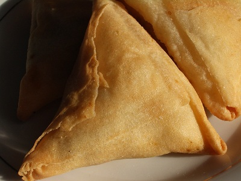

# Samosas

*These popular golden stuffed parcels can be filled with a variety of vegetable or meat mixtures. Here they are stuffed with spiced minced chicken.*

**Yield:** 20 samosas (serves 4-6)

## Overview
Samosas are the ultimate Indian snack: crispy, angular parcels of golden filo pastry enclosing spiced, fragrant filling. The technique is simple yet satisfying, triangular folding, egg wash sealing, and oven-baking creates a light, shattering crust. Unlike deep-fried versions, these are baked for a lighter result while maintaining crispness. Serve warm with chutney, raita, or lemon juice. These are elegant enough for entertaining, casual enough for snacking.

## Ingredients

### Filling
- 2 tablespoons sunflower oil
- 300 grams minced chicken
- 1 onion (chopped)
- 1 tablespoon medium curry powder
- 50 grams cooked potato (diced)
- 4 tablespoons fresh coriander leaves (finely chopped)
- 4 tablespoons fresh mint leaves (finely chopped)
- Salt and freshly ground black pepper

### Pastry & Assembly
- 5 sheets filo pastry (25 x 50 cm)
- 1 egg (beaten)

## Method

### Stage 1 – Prepare Filling
1. Heat the sunflower oil in a frying pan over medium-high heat.
1. Add the minced chicken, chopped onion, and curry powder.
1. Season with salt and black pepper.
1. Cook for about 10 minutes, uncovered, until the chicken is just cooked and the juices have evaporated from the pan.
1. Add the diced cooked potato and mix well.
1. Remove the pan from the heat and stir in the chopped coriander and mint.
1. Leave to cool completely (this is important; warm filling will make the pastry soggy).

### Stage 2 – Prepare Filo
1. Lay the filo pastry out on a clean board.
1. Cut in half lengthways, then once more widthways, so that you have 4 rectangles from each whole sheet.
1. You should have approximately 20 rectangles total.
1. Cover all the pieces of filo with a barely damp tea towel to prevent them from drying out.
1. Work with one rectangle at a time, keeping the others covered.

### Stage 3 – Assemble Samosas
1. Take one piece of filo and lay it width-ways in front of you.
1. Pile a dessert spoon of the cooled chicken mixture onto the end closest to you.
1. Fold the filo over the filling to form a triangle and continue to fold and enclose the filling in a triangular parcel.
1. **Technique:** Fold bottom corner up to create a triangle, then fold the triangle up, then fold the flap over, creating tight, angular triangles.
1. Brush the finishing edge with a little of the beaten egg to seal it.
1. Place on a baking tray.
1. Repeat the process until you have 20 samosas.
1. These can be prepared earlier in the day up to this point and chilled in the fridge.

### Stage 4 – Bake to Golden
1. When ready to bake the samosas, preheat the oven to 200°C.
1. Glaze all the finished samosas all over with beaten egg using a pastry brush.
1. Bake the samosas in the preheated oven for 10-12 minutes, until golden brown in colour.
1. Remove from the oven and cool on a wire rack for 2-3 minutes before serving.

## Notes
- **Cooked Filling:** The filling must be completely cool before assembly; warm filling will soften the pastry and prevent crisp results.
- **Filo Coverage:** Keep filo covered while working; exposure to air dries it out and makes it brittle and difficult to fold.
- **Egg Wash:** This seals the pastry edges and creates the golden, glossy finish; don't skip it.
- **Triangular Shape:** The tight, angular triangles aren't just aesthetics; they create crispy corners and edges.
- **Make-Ahead:** These assemble well several hours ahead; cover with a damp cloth and refrigerate until baking.
- **Yield:** Each filo sheet (cut into 4) makes 4 samosas; this recipe yields approximately 20.

## Variations
**Spicy Heat:** Increase curry powder to 1.5 tablespoons or add 1 fresh green chilli to the filling.
**Vegetarian:** Substitute the chicken with 200g diced cooked cauliflower mixed with 150g cooked chickpeas for a pleasant textural mix.
**Lamb Filling:** Use 300g minced lamb instead of chicken; reduce cooking time slightly (lamb cooks faster).
**With Peas:** Add 50g frozen peas to the filling in the final minute of cooking.
**Paneer Version:** Replace chicken with 200g crumbled paneer cheese mixed with the potatoes for a vegetarian alternative.

## Serving
Serve with: Tamarind chutney, mint chutney, raita, yoghurt dips
Accompany with: Lemon wedges, fresh coriander, sliced red onion
Vessels: Serve warm on a platter lined with fresh coriander

## Storage
- Store in an airtight container for up to 3 days at room temperature
- Reheat in a 160°C oven for 5-8 minutes to re-crisp; do not microwave (pastry becomes soft)
- Freeze uncooked assembled samosas on a tray for up to 3 months; bake directly from frozen (add 2-3 minutes to baking time)
- Do not freeze cooked samosas; texture degrades significantly