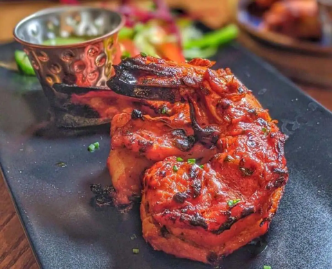

# Tandoori King Prawn

*King prawns are luxurious, delicate, and take beautifully to tandoori preparation. A double-marinade technique creates silky texture and complex flavor.*

**Serves:** 4

## Overview
Tandoori King Prawns are elegant, restaurant-quality appetizers or mains. The prawns undergo two rapid marinades: first, an oil-based bath with garlic, ginger, and turmeric to season quickly; second, a creamy, spiced marinade with yoghurt, cream cheese, and fresh herbs for silky texture and depth. The double approach respects the delicate nature of prawns while ensuring flavor on all sides. The brief cooking (5-8 minutes) preserves succulence. Serve with lemon and herbs. This is luxurious seafood preparation made simple.

## Ingredients

### Prawns
- 500g raw king prawns (peeled and de-veined)

### First Marinade (Oil & Spice)
- 1 tablespoon rapeseed oil
- 2 teaspoons garlic and ginger paste
- 1/4 teaspoon ground turmeric
- 1 teaspoon salt
- 1/2 teaspoon finely ground white pepper

### Second Marinade (Creamy & Rich)
- 2 tablespoons Greek yoghurt
- 1 tablespoon cream cheese
- 1 tablespoon single (light) cream
- 1cm piece of fresh ginger (peeled and finely chopped)
- 1 fresh green chilli (finely chopped)
- 1 tablespoon fresh coriander (chopped)
- 1 teaspoon mace and cardamom (ground)
- 1 teaspoon salt
- 1 teaspoon garlic powder
- 1 teaspoon ajwain (carom) seeds

## Method

### Stage 1 – First Marinade (Oil & Spice Base)
1. In a large bowl, combine the rapeseed oil, garlic and ginger paste, turmeric, salt, and white pepper.
1. Mix well to create a smooth paste.
1. Add the raw king prawns and coat thoroughly with the mixture.
1. Let sit for 5 minutes while you prepare the second marinade.
1. This first bath seasons the prawns and begins the flavor process.

### Stage 2 – Prepare Second Marinade (Creamy Layer)
1. In a separate bowl, combine the Greek yoghurt, cream cheese, and single cream.
1. Mix thoroughly with a spoon or whisk until smooth and emulsified.
1. Add the finely chopped fresh ginger and green chilli.
1. Add the fresh coriander, ground mace and cardamom, salt, garlic powder, and ajwain seeds.
1. Mix everything together until well combined and smooth.
1. The mixture should be creamy yet spiced throughout.

### Stage 3 – Second Marinade (Creamy Coating)
1. Pour the creamy spiced marinade over the prawns in their first marinade.
1. Using your hands, work the creamy mixture gently into every prawn, ensuring complete coating.
1. Be gentle to avoid breaking the delicate prawns.
1. Cover and leave for about 20 minutes at room temperature.
1. **Note:** Unlike chicken tikka, prawns don't benefit from extended marination; 20 minutes is sufficient as they're delicate and can become mushy.

### Stage 4 – Grill to Charred
1. Prepare your barbecue for direct heat cooking (charcoal or gas set to high).
1. Thread the marinated prawns onto metal skewers, leaving small gaps between each.
1. Alternatively, you can cook them directly on a clean, oiled barbecue grill.
1. Place over the hot fire.
1. Cook, turning frequently (every 1-2 minutes), for a total of 5-8 minutes.
1. The prawns are done when they've turned pink throughout and show light charring on the exterior.
1. **Key:** Prawns cook very quickly; overcooking makes them rubbery and tough.
1. Transfer to a warm serving platter immediately.
1. Rest for 1-2 minutes before serving.

## Notes
- **Delicate Protein:** Prawns are far more delicate than chicken; they cook in 5-8 minutes. Watch constantly to avoid overcooking.
- **Brief Marination:** Unlike chicken (which benefits from 6-48 hours), prawns only need 20 minutes; longer marination can make the texture mushy from the acid.
- **Two-Marinade Technique:** The oil-based first marinade seasons quickly; the creamy second marinade adds silky texture. Both are essential.
- **Cream Cheese & Cream:** These create silky texture and richness; don't omit them as they transform tough prawns into tender.
- **Doneness:** Prawns turn opaque pink when cooked through; use that as your visual cue. A prawn thermometer reads 60°C when done.
- **Metal Skewers:** Use flat metal skewers to prevent rolling. Flat skewers hold prawns securely.
- **Gentle Handling:** Prawns' delicate shells and flesh are easily damaged; handle with care throughout marination and cooking.
- **Ajwain Seeds:** Carom seeds add unusual, slightly thyme-like flavor; they're traditional in tandoori preparations. Find in Indian markets.

## Variations
**Spicy Heat:** Add 1/4 teaspoon cayenne pepper to either marinade.
**Extra Herbs:** Include 1 tablespoon fresh mint leaves in the second marinade for cooling herbal notes.
**Garlic Emphasis:** Increase garlic powder to 1.5 teaspoons for savory depth.
**Served Cold:** Marinate and cook the prawns, then chill and serve as a seafood salad with lemon and coriander.
**With Vegetables:** Thread roasted peppers, zucchini, or red onion between prawns on the skewer.

## Serving
Serve as: Elegant starter or seafood main course
Garnish: Fresh coriander, lemon wedges, thin onion slices
Accompany with: Mint raita, lemon chutney, fresh lime juice
With: Basmati rice, naan bread, salad

## Storage
- Refrigerate marinated raw prawns for no more than 4 hours before cooking (they deteriorate quickly)
- Refrigerate cooked prawns for up to 1 day in an airtight container
- Serve chilled as a salad within hours of cooking
- Do not freeze marinated or cooked prawns; texture and quality degrade significantly 