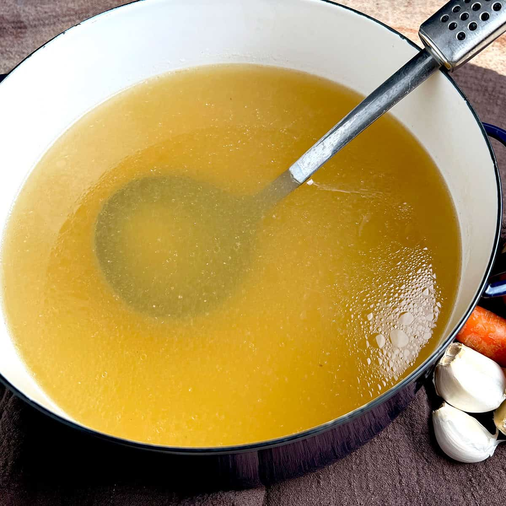

# BIR Spice Stock

## Overview
A fragrant aromatic stock made from whole spices and fresh herbs. This versatile base adds depth to curries when extra liquid is needed to thin or lighten a sauce. While water works, this stock imparts subtle layers of flavour that elevate the final dish.

**Makes:** 750ml (3¼ cups)
**Prep Time:** 5 minutes
**Cook Time:** 35 minutes

## Ingredients
- Handful of green cardamom pods, lightly bruised
- 15 Indian bay leaves (cassia leaves)
- 2.5cm (1 inch) piece of cinnamon stick or cassia bark
- 20 black peppercorns
- Large handful of star anise
- 1 tsp roasted cumin seeds
- Large bunch of coriander (cilantro), stems and leaves roughly chopped
- 1 or more fresh green chillies, to taste, halved lengthways (optional)
- 1 litre (4½ cups) water

## Method

### Stage 1 – Boil
1. Put 1 litre (4½ cups) of water in a pan and bring to a rolling boil.

### Stage 2 – Infuse
1. Throw in all the herbs and spices.
2. Stir to combine.
3. Reduce to a simmer and cook for about 30 minutes.

### Stage 3 – Strain
1. Strain through a fine sieve into a clean container.
2. Use immediately or allow to cool.

## Notes
- **Use:** Add to curries when extra liquid is needed or when sauce is too thick.
- **Spice level:** Adjust heat by increasing or decreasing fresh green chillies to taste.
- **Substitutions:** Use dried chillies if fresh are unavailable; adjust quantity as dried are more concentrated.

## Storage
- Keeps 3 days refrigerated in airtight containers
- Freezes well up to 3 months
- Can be made in batches and frozen in ice cube trays for easy portioning

## Serving Suggestions
Add to curries when:
- Sauce needs thinning
- Additional aromatic depth is desired
- Curry is too concentrated or rich