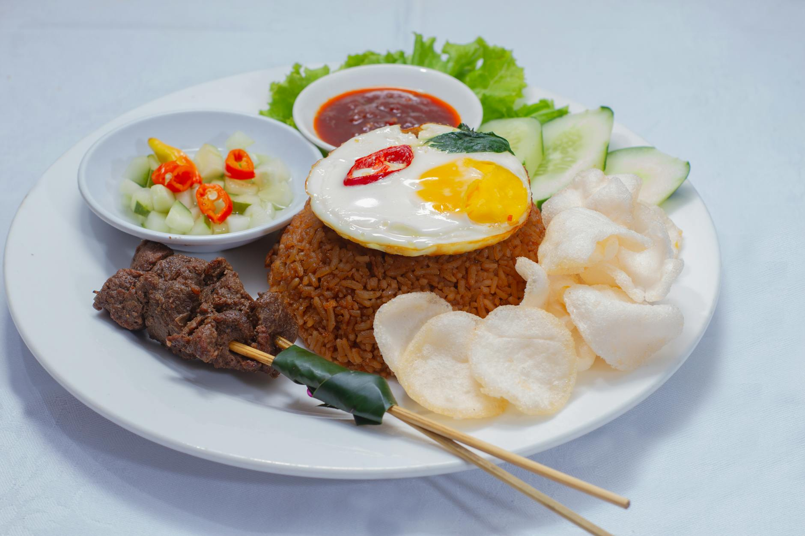

# Beef Nasi Goreng

*Nasi goreng (literally "fried rice") is Indonesia's national rice dish, traditionally made with whatever is on hand and a slick of kecap manis.*

**Serves:** 4
**Prep Time:** 15 minutes
**Cook Time:** 15 minutes

## Overview
Indonesia's national fried rice, traditionally a way to put yesterday's leftovers to work and now a fixture from street stalls to weeknight kitchens. Beef mince keeps the cooking time short, while kecap manis, soy, shrimp paste and a crumbled stock cube layer the savouriness from four directions. The trick is pressing the rice into the wok and leaving it alone long enough to pick up a proper char before tossing.

## Ingredients

### Stir-Fry
- 2 tablespoons vegetable oil (plus 1 extra teaspoon)
- 250 grams beef mince (ground beef)
- 1 onion (sliced)
- 3 garlic cloves (finely chopped)
- 1 long red chilli (finely chopped)
- ½ teaspoon shrimp paste
- 1 beef stock cube (crumbled)
- 4 cups cooked rice (preferably day-old)
- 2 tablespoons soy sauce
- 2 teaspoons kecap manis (or sweet dark soy sauce)

### To Serve
- ¼ cup fried shallots
- Sliced cucumber
- Sliced tomato
- [Sambal oelek](../../base-ingredients/sambal/sambal-oelek.md)

## Method

### Stage 1 – Sear the Beef
1. Heat the 2 tablespoons of vegetable oil in a wok over high heat.
2. Add the beef mince and press it into the wok in a single layer.
3. Sear undisturbed for 4 to 5 minutes to develop a deep crust.
4. Flip, break up and stir-fry until almost cooked through.

### Stage 2 – Build the Aromatics
1. Add the sliced onion and stir-fry for 3 minutes, until softened.
2. Add the garlic and chilli and stir-fry for another 30 seconds.

### Stage 3 – Stir-Fry the Rice
1. Push everything to one side of the wok and add the extra teaspoon of oil to the empty side.
2. Add the shrimp paste and move it through the oil to dissolve, then mix it through the rest of the ingredients.
3. Stir in the crumbled beef stock cube.
4. Add the rice, soy sauce and kecap manis.
5. Stir-fry until the rice is well coated and heated through.
6. Remove from the heat and divide between serving bowls.

### Stage 4 – Plate Up
1. Sprinkle each bowl with fried shallots.
2. Serve with cucumber, tomato and a spoonful of sambal oelek on the side.

## Notes
- **Day-old rice:** Cold rice fries far better than freshly cooked. The grains are drier and don't clump in the wok. Spread fresh rice out and chill for at least an hour if you can't wait until the next day.
- **Searing the mince:** Pressing the beef into the wok and leaving it untouched develops a real crust. Resist the urge to stir for the first few minutes.
- **Shrimp paste:** Half a teaspoon is enough to add the funky umami that sets nasi goreng apart from a generic fried rice.

## Variations
**Chicken nasi goreng:** Replace the beef with diced chicken thigh; cook the same way but stir-fry rather than sear.
**Vegetarian:** Drop the beef and stock cube; bulk up with mushrooms or tofu, and use vegetarian "fish" sauce in place of shrimp paste.
**Top with a fried egg:** Crown each bowl with a sunny-side-up egg; the runny yolk emulsifies into the rice.

## Serving
Serve with: A wedge of lime, prawn crackers, and extra sambal at the table
Garnish with: A handful of finely sliced spring onion or a fresh red chilli

## Storage
- Keeps 2 days refrigerated; reheat in a hot wok with a splash of water
- Not recommended for freezing, as the rice texture suffers
- Garnishes (cucumber, tomato) should be added fresh each time
