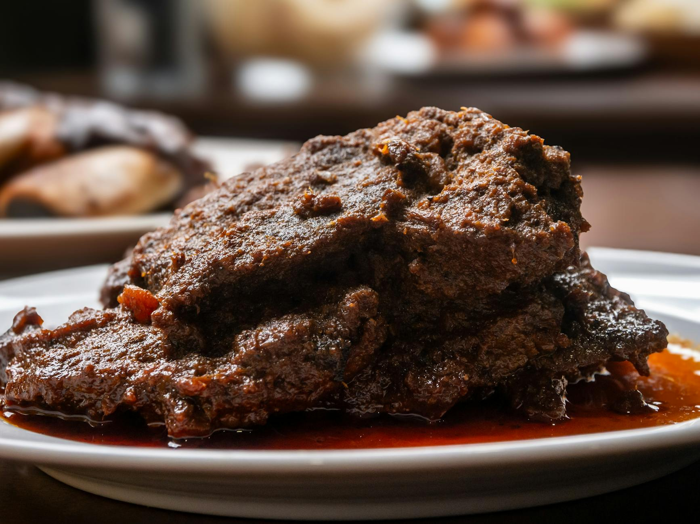

# Beef Rendang

## Overview
Rendang is a spicy meat dish which originated from the Minangkabau ethnic group of Indonesia, and is now commonly served across the country. One of the characteristic foods of Minangkabau culture, it is served at ceremonial occasions and to honour guests. This rich, aromatic curry features beef slowly simmered in coconut milk and spices until deeply flavoured.

**Serves:** 6

## Ingredients

### Rendang Spice Paste
- 100 grams grated fresh coconut
- 8 dried Kashmiri chillies
- 2 tablespoons coriander seeds
- 1 teaspoon cumin seeds
- 1 teaspoon turmeric powder
- 225 grams shallots (roughly chopped)
- 30 grams garlic (roughly chopped)
- 50 grams peeled galangal or ginger
- 6 hot red bird's eye chillies (de-seeded and roughly chopped)
- 100 ml water

### Beef Rendang
- 3 tablespoons coconut oil
- 1.5 kg braising steak (cut into chunks)
- 800 ml canned coconut milk
- 4 lemongrass stalks (bruised)
- 12 dried kaffir lime leaves (crumbled)
- 2 cinnamon sticks
- 125 ml tamarind water
- 1 tablespoon palm sugar
- Salt to taste

## Method

### Stage 1 – Make the Spice Paste
1. Heat a dry, heavy-based frying pan over medium heat.
2. Add the coconut and stir for a few minutes until richly golden, don't let it burn.
3. Tip into a food processor and leave to cool.
4. Put the dried Kashmiri chillies, coriander seeds, and cumin seeds into a spice grinder and grind to a fine powder.
5. Add this to the processor with the rest of the spice paste ingredients and 100 ml water.
6. Blend to a smooth-ish paste.

### Stage 2 – Make the Rendang
1. Heat the coconut oil in a large, heavy-based frying pan.
2. Add the beef and fry briefly until it has changed colour but not browned.
3. Add the spice paste, coconut milk, lemongrass, lime leaves, cinnamon sticks, and 1½ teaspoons salt.
4. Bring to the boil, reduce the heat, and add the tamarind water.
5. Leave to simmer, uncovered, for 2½ hours, stirring occasionally and more frequently towards the end, until the beef is tender and the sauce has reduced and thickened.
6. Remove the lemongrass and stir in the palm sugar. Season to taste.

## Notes
- **Key technique:** Slow simmering is essential, the sauce must reduce significantly to concentrate flavours and coat the meat.
- **Tamarind water:** Soak 60 grams of tamarind pulp in 125 ml hot water for 5 minutes. Break up with your fingers and strain through a fine-meshed sieve, discarding fibrous material and seeds.
- **Substitutions:** Use ginger if galangal is unavailable; adjust chilli heat by reducing bird's eye chillies.
- **Make-ahead:** Rendang tastes better the next day as flavours develop and deepen.

## Serving
Serve with: Jasmine rice and a fresh cucumber salad to balance the richness

## Storage
- Keeps 4 days refrigerated
- Freezes well up to 3 months
- Flavour improves after 24 hours