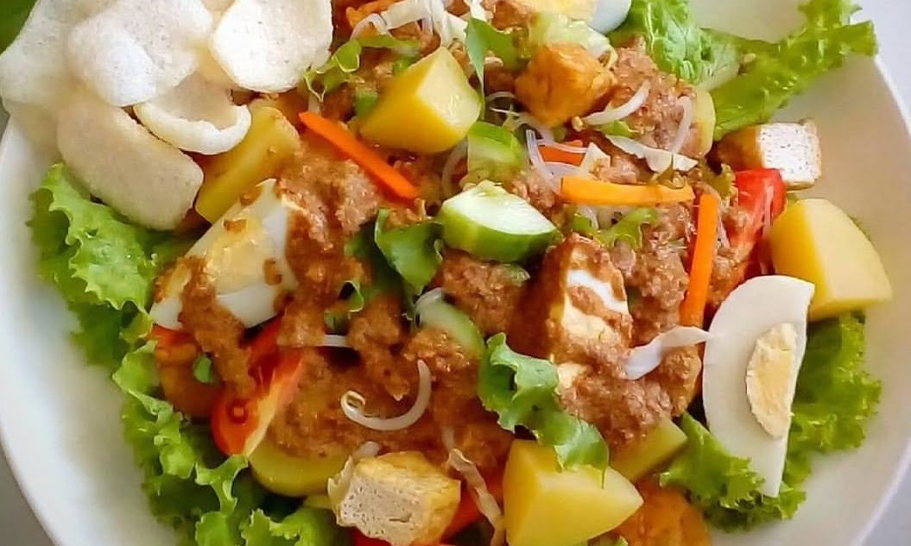

# Gado-Gado

*Indonesia's vegetable salad with peanut sauce: barely-cooked beans, cabbage, beansprouts and potato draped in a thick, spicy, lime-sharp peanut dressing. Eaten cool or warm; the dressing is the dish.*

**Serves:** 4

**Prep Time:** 20 minutes

**Cook Time:** 15 minutes

## Overview
A mix of raw and lightly-blanched vegetables; firm tofu pan-fried; hard-boiled eggs halved. The peanut sauce is built fresh from roasted peanuts blended with garlic, chilli, kecap manis, tamarind, lime and water. Pour over at the table; toss; eat.

## Ingredients

### Salad
- 200 g new potatoes (cubed)
- 200 g green beans (cut into 4 cm lengths)
- 200 g savoy cabbage (shredded)
- 200 g beansprouts
- 200 g firm tofu (cut into 2 cm cubes)
- 2 tablespoons vegetable oil (for frying tofu)
- 4 large eggs (hard-boiled, halved)
- ½ cucumber (sliced)
- 50 g prawn crackers (vegetarian; for serving — optional)

### Peanut sauce
- 200 g roasted unsalted peanuts
- 3 garlic cloves
- 2 long red chillies (deseeded for less heat)
- 1 cm fresh ginger
- 3 tablespoons kecap manis (Indonesian sweet soy)
- 2 tablespoons light soy sauce
- 1 tablespoon tamarind paste (or lime juice if unavailable)
- 2 tablespoons brown sugar
- Juice of 1 lime
- 200-300 ml hot water (to loosen)
- Salt to taste

## Method

### Stage 1 – Vegetables
1. Boil the potatoes 8-10 minutes until tender; drain.
1. In the same water, blanch the beans 2 minutes, then the cabbage 1 minute (just-wilted), then the beansprouts 30 seconds. Drain each through a colander; refresh under cold water; pat dry.

### Stage 2 – Tofu
1. Heat the oil in a frying pan over medium-high heat.
1. Fry the tofu 6-8 minutes, turning, until deep golden on all sides. Drain on kitchen paper.

### Stage 3 – Peanut sauce
1. Blend the peanuts to a coarse rubble in a food processor; add the garlic, chillies, ginger, kecap manis, soy, tamarind, sugar, lime; pulse to a thick paste.
1. With the motor running (or stirring by hand), add the hot water gradually until the sauce is thick but pourable.
1. Taste; adjust lime, sugar, soy and salt — should be balanced sweet/salty/sour with heat.

### Stage 4 – Assemble
1. Arrange the potato, beans, cabbage, beansprouts, tofu, eggs and cucumber on a large platter.
1. Spoon the peanut sauce generously over the top, or serve alongside.
1. Top with crushed prawn crackers if using.

## Notes
- **Vegetable mix is flexible:** Add carrot, bok choy, fried tempeh, watercress; subtract whatever you don't have. Gado-gado is a household salad — every cook makes it differently.
- **Sauce thickness:** Should be thick enough to coat a spoon. If too thick after sitting, loosen with hot water.
- **Vegetarian prawn crackers:** Many "prawn crackers" contain shrimp; check labels or use cassava crackers (krupuk) instead.

## Storage
- Best fresh. Sauce keeps 1 week refrigerated; thickens in the fridge — loosen with hot water on use. Vegetables don't refresh well; cook fresh.
