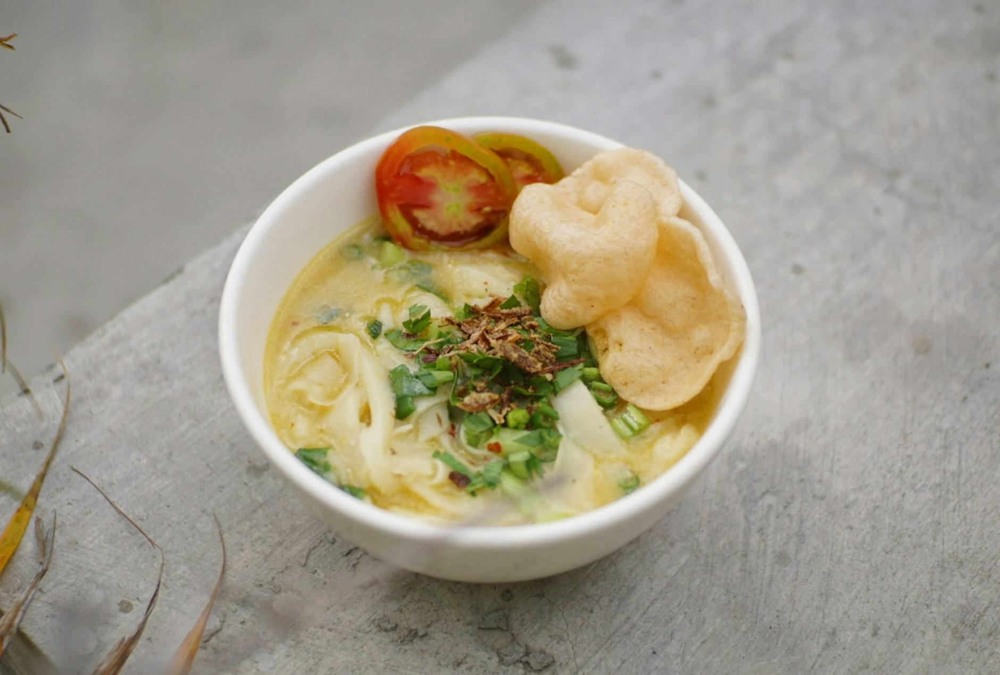

# Indonesian Chicken Noodle Soup (Soto Ayam)

*Soto ayam is a fragrant turmeric-and-coconut broth from across the Indonesian archipelago, served at street stalls and family tables alike. Mee soto is the closely related egg-noodle version; the two share the same spice paste and broth.*

**Serves:** 4
**Prep Time:** 10  minutes
**Cook Time:** 1 hour 20 minutes

## Overview
A clear, golden chicken broth fortified with a freshly pounded turmeric, lemongrass and shallot paste, finished with coconut milk and a squeeze of lime. The dish is built in three layers: a slow-simmered chicken stock, a fried spice paste that becomes the soup's backbone, and quick-soaked rice vermicelli to carry it all. Comforting and aromatic in equal measure.

## Ingredients

### Chicken Stock
- 2 tablespoons vegetable oil
- 4 chicken thigh fillets
- 1 stalk lemongrass (bruised)
- 2 shallots (quartered)
- 3 slices fresh ginger
- 3 makrut lime leaves
- 8 cups water
- Sea salt to taste

### Spice Paste
- 1 stalk lemongrass (pale part only, finely chopped)
- 6 small red Asian shallots (or 3 brown eschallots, roughly chopped)
- 3 garlic cloves (roughly chopped)
- 4 cm fresh turmeric (peeled and roughly chopped, or 1 teaspoon turmeric powder)
- 3 cm ginger (peeled and roughly chopped)
- 3 teaspoons ground coriander
- 1 teaspoon ground cumin

### Broth & Finish
- 1 tablespoon vegetable oil
- 1 cup coconut milk
- 1 tablespoon lime juice
- Sea salt to taste

### To Serve
- 200 grams dried rice vermicelli
- Coriander (cilantro) leaves
- [Sambal oelek](../../base-ingredients/sambal/sambal-oelek.md)
- Lime wedges

## Method

### Stage 1 – Make the Chicken Stock
1. Heat the vegetable oil in a large stock pot over high heat.
2. Season the chicken thighs with salt and sear for 2 to 3 minutes on each side.
3. Add the lemongrass, shallots, ginger, makrut lime leaves and 8 cups of water.
4. Bring to a simmer, reduce the heat to medium, and cook for 45 minutes, skimming the surface occasionally.
5. Lift the chicken out and set aside. Strain the broth and reserve the liquid.
6. When the chicken is cool enough to handle, shred or roughly chop the meat.

### Stage 2 – Make the Spice Paste
1. Place all the spice paste ingredients in a blender.
2. Blend to a smooth paste, adding a couple of tablespoons of the chicken stock if it refuses to come together.

### Stage 3 – Build the Broth
1. Heat 1 tablespoon of vegetable oil in a large pot over medium-high heat.
2. Add the spice paste and fry, stirring, for about a minute or until fragrant. (Freeze any leftover paste for another batch.)
3. Stir in the coconut milk and simmer for 2 minutes.
4. Pour in the reserved chicken broth and simmer for a further 2 minutes.
5. Stir in the lime juice and season with salt to taste.

### Stage 4 – Cook the Noodles & Assemble
1. Soak the rice vermicelli in hot water for 3 to 4 minutes, until tender.
2. Drain and divide between serving bowls.
3. Top each bowl with shredded chicken, then ladle over the hot soup.
4. Finish with a spoonful of sambal oelek, a scatter of coriander leaves and a wedge of lime.

## Notes
- **Spice paste depth:** Frying the paste until fragrant is what builds flavour. Stop too early and the soup tastes raw.
- **Fresh turmeric:** Fresh turmeric gives a brighter, cleaner flavour than the powdered form. Wear gloves, the stains last for days.
- **Sambal oelek:** A simple Indonesian chilli paste, found in the Asian section of most supermarkets or made in advance from the linked recipe.
- **Mee soto vs soto ayam:** The two dishes share this broth. Soto ayam uses rice vermicelli or ketupat (compressed rice cakes); mee soto uses yellow hokkien-style egg noodles.

## Variations
**Mee soto:** Swap the rice vermicelli for cooked yellow hokkien noodles for the egg-noodle version of the soup.
**Spicier:** Stir 1 to 2 teaspoons of sambal oelek into the broth at the end of Stage 3 instead of serving it at the table.

## Serving
Serve with: Steamed jasmine rice or ketupat on the side for a more substantial meal
Garnish with: Crispy fried shallots, a soft-boiled egg, and extra lime wedges

## Storage
- Keeps 3 days refrigerated; store the noodles separately so they don't go soft
- Broth and spice paste freeze well up to 2 months
- Best eaten the day it is made, with reheated broth poured over freshly soaked noodles
