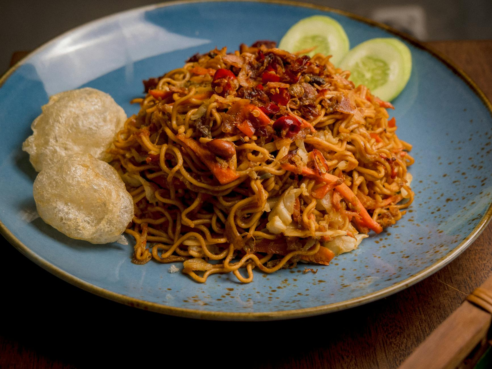

# Indonesian Mee Goreng

*Mee goreng (literally "fried noodles") is a hawker classic across Indonesia and Malaysia, a fast wok-fried tangle of noodles with kecap manis, soy and a hit of shrimp paste.*

**Serves:** 2
**Prep Time:** 10 minutes
**Cook Time:** 10 minutes

## Overview
Fresh egg noodles tossed in a glossy, sweet-savoury sauce of kecap manis, soy, ketchup, sesame oil and shrimp paste, with pork, prawns, cabbage and bean sprouts. The dish is finished with thin egg ribbons and a scatter of spring onion. Quick to cook once the components are prepped, but rewards a properly hot wok and a sauce mixed in advance.

## Ingredients

### Sauce
- 3 tablespoons kecap manis (or dark sweet soy sauce)
- 3 tablespoons light soy sauce
- 2 tablespoons ketchup
- 1 tablespoon sesame oil
- 1 teaspoon shrimp paste
- 1 teaspoon chilli powder

### Egg Ribbons
- 2 eggs (lightly beaten)
- 1 tablespoon vegetable oil

### Stir-Fry
- 1 tablespoon vegetable oil
- 3 garlic cloves (chopped)
- 200 grams sliced pork (scotch fillet or pork fillet)
- 200 grams peeled and deveined prawns
- ¼ cup sliced white cabbage
- 400 grams fresh Chinese egg noodles
- ½ cup bean sprouts
- ¼ cup sliced spring onions

### To Serve
- Sliced red chilli
- Lime wedges

## Method

### Stage 1 – Make the Egg Ribbons
1. Lightly beat the eggs in a small bowl.
2. Heat a wok or non-stick frying pan over medium-low heat.
3. Add 1 tablespoon of vegetable oil and swirl to coat the pan.
4. Pour in the egg, swirling and using a spatula to spread it across the pan.
5. Cook undisturbed over low heat until the egg sets and releases.
6. Slide onto a cutting board and slice into thin ribbons.

### Stage 2 – Mix the Sauce
1. In a small bowl, combine the kecap manis, light soy sauce, ketchup, sesame oil, shrimp paste and chilli powder.
2. Stir until smooth.

### Stage 3 – Stir-Fry & Combine
1. Heat the remaining tablespoon of oil in a wok over high heat.
2. Add the garlic and cook for 30 seconds, until fragrant.
3. Add the pork and stir-fry until almost cooked through.
4. Add the prawns and stir-fry until cooked.
5. Add the cabbage, noodles, bean sprouts, spring onions and the sauce.
6. Stir-fry until everything is well coated and glossy.
7. Remove from the heat and divide between serving bowls.

### Stage 4 – Plate Up
1. Top each bowl with a generous tangle of the egg ribbons.
2. Scatter with sliced red chilli.
3. Serve with a wedge of lime.

## Notes
- **Kecap manis:** This dark Indonesian sweet soy sauce is the backbone of the dish; there is no clean substitute, but a mixture of dark soy and brown sugar will do at a pinch.
- **Shrimp paste:** A small amount goes a long way. It mellows the ketchup and adds the funky depth that distinguishes mee goreng from a generic stir-fry.
- **Wok hei:** The dish lives or dies by the heat of the pan. The noodles should pick up a hint of char, not steam in their own moisture.
- **Egg ribbons first:** Cooking the egg flat and slicing it into ribbons (rather than scrambling it through the wok) keeps the noodles glossy and the egg distinct.

## Variations
**Chicken or beef:** Replace the pork with thinly sliced chicken thigh or rump steak; cook for the same length of time.
**Vegetarian:** Drop the pork, prawns and shrimp paste; double the cabbage, add sliced firm tofu, and use a teaspoon of light soy in place of the shrimp paste.

## Serving
Serve with: Pickled green chillies in vinegar and a small bowl of [sambal oelek](../../base-ingredients/sambal/sambal-oelek.md) for table seasoning
Garnish with: Crispy fried shallots and a sprig of coriander

## Storage
- Best eaten straight from the wok while the noodles are still glossy
- Leftovers keep 1 day refrigerated; reheat in a hot wok with a splash of water
- Sauce keeps 1 week refrigerated in a sealed jar
