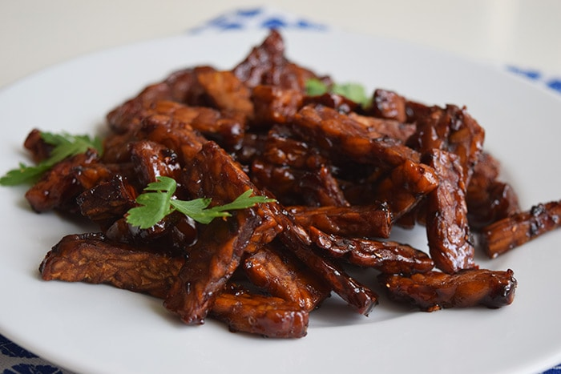

# Tempeh Goreng

*Indonesian fried tempeh: thick batons marinated in garlic, coriander and tamarind, then deep-fried until shatteringly crisp on the outside and dense and nutty within. Served as a snack, a side, or a main with rice and sambal.*

**Serves:** 4

**Prep Time:** 15 minutes (plus 30 min marinade)

**Cook Time:** 10 minutes

## Overview
Tempeh is sliced into thick fingers; marinated in a paste of garlic, coriander seed, tamarind, salt and water. The batons drain briefly, then deep-fry in batches until crisp and deep golden. Best eaten hot, with kecap manis or sambal for dipping.

## Ingredients

- 400 g tempeh (cut into 1.5 cm thick batons, about 6 cm long)
- 5 garlic cloves
- 1 teaspoon coriander seeds
- 1 tablespoon tamarind paste
- 1 teaspoon salt
- 1 teaspoon palm sugar (or brown sugar)
- 200 ml water
- Vegetable oil (for deep-frying)

### To serve
- Kecap manis (Indonesian sweet soy)
- Sambal oelek or sliced bird's eye chillies
- Steamed rice

## Method

### Stage 1 – Marinade
1. Crush the garlic and coriander seeds to a paste in a mortar (or finely mince).
1. Mix with the tamarind, salt, sugar and water in a wide dish.
1. Add the tempeh batons; turn to coat. Marinate 30 minutes — the tempeh soaks up the liquid.

### Stage 2 – Drain
1. Lift the batons out of the marinade; let them drain on a wire rack 5 minutes (excess water spits in hot oil).

### Stage 3 – Fry
1. Heat 4 cm of oil in a wok or deep pan to 180°C (a tempeh corner should bubble vigorously when dipped).
1. Fry the batons in 2 batches for 4-5 minutes each until deep golden and crisp on all sides.
1. Lift onto kitchen paper to drain.

### Stage 4 – Serve
1. Eat immediately, dipped in kecap manis with sambal alongside, or piled over rice.

## Notes
- **Tempeh quality matters:** Look for the densely packed, slightly mottled (white-grey) Indonesian-style tempeh; supermarket "soy fermented blocks" sometimes have a much denser, less interesting texture.
- **Don't skip the drain:** Wet tempeh in hot oil splatters dangerously and gives a soggy crust.
- **Fry temperature:** Below 170°C and the tempeh absorbs oil and goes greasy; above 195°C and the outside burns before the inside heats through.

## Storage
- Best eaten right away. Re-crisp leftovers in a hot dry pan or oven at 200°C for 5 minutes — don't microwave.
