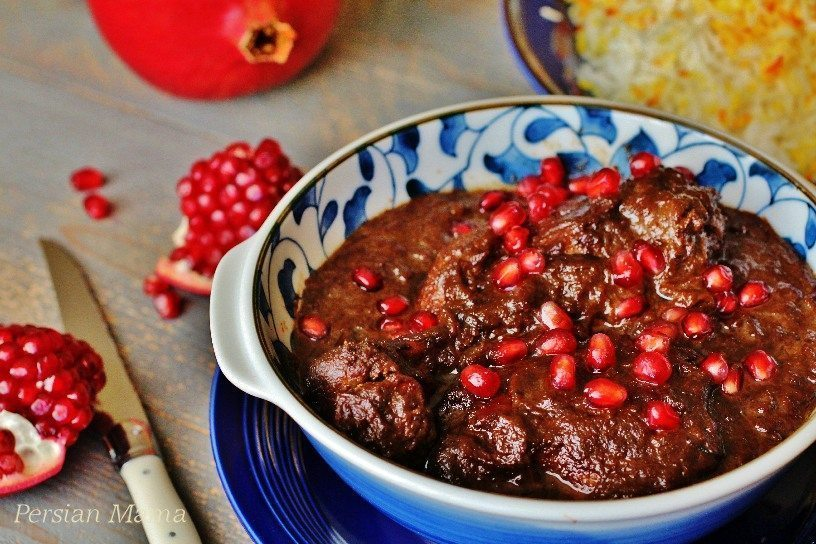

# Khoresh-e Fesenjan

*Persian walnut and pomegranate stew: chicken (or duck) braised in a sauce of finely-ground toasted walnuts and pomegranate molasses until the sauce turns deep mahogany and silky. Sweet, sour, intensely savoury — one of Iran's most distinctive flavour profiles. Saffron and a pinch of sugar balance the molasses; eats over white rice.*

**Serves:** 6

**Prep Time:** 20 minutes

**Cook Time:** 1¾ hours

## Overview
Walnuts toast and grind to a paste. Onions soften slowly with turmeric and saffron; chicken thighs sear, then poach in a stock that the walnut paste loosens into. Pomegranate molasses, sugar and lemon balance the sauce as it darkens; chicken returns to absorb flavour. Slow-cook until the oil splits out — the sign Fesenjan is ready.

## Ingredients

- 6 chicken thighs (bone-in, skin on) or 1 duck (jointed)
- 2 tablespoons olive oil
- 2 large onions (finely chopped)
- 1 teaspoon ground turmeric
- A generous pinch of saffron (steeped in 3 tablespoons hot water 10 min)
- 400 g shelled walnuts
- 1 litre chicken or vegetable stock
- 4 tablespoons pomegranate molasses (Iranian if possible)
- 2 tablespoons brown sugar (or to taste)
- Juice of half a lemon
- 1½ teaspoons salt
- ½ teaspoon black pepper
- ½ teaspoon ground cinnamon

### To serve
- Hot chelo (Persian saffron rice)
- Pomegranate seeds
- A few mint leaves

## Method

### Stage 1 – Walnut paste
1. Toast the walnuts in a dry pan over medium heat 5-6 minutes, stirring, until fragrant and lightly coloured.
1. Cool slightly; blitz in a food processor until they form a coarse, oily paste — about 1 minute. Don't take them all the way to butter; texture is good.

### Stage 2 – Sear chicken
1. Heat the oil in a wide heavy pan over medium-high heat.
1. Salt and pepper the chicken; sear skin-side down 4-5 minutes until golden; flip; sear 2 more minutes; lift out.

### Stage 3 – Onions
1. Reduce the heat to medium-low.
1. Cook the onions in the rendered fat 12-15 minutes until soft and golden.
1. Stir in the turmeric and half the saffron-water; cook 1 minute.

### Stage 4 – Build the sauce
1. Add the walnut paste; stir 2-3 minutes (it'll absorb the oil).
1. Pour in the stock; whisk to break up any lumps.
1. Add the pomegranate molasses, sugar, salt and cinnamon.
1. Bring to a simmer; reduce to lowest heat.

### Stage 5 – Simmer
1. Return the chicken to the pan; nestle into the sauce.
1. Partly cover; cook 1 hour - 1¼, stirring every 15 minutes so the walnuts don't catch on the bottom.
1. The sauce should darken to deep mahogany and the oil should start to glisten on the surface — that's the sign it's done.

### Stage 6 – Balance and finish
1. Stir in the lemon juice and the remaining saffron-water.
1. Taste; adjust sugar (more if too sour) or molasses (more if too sweet).

### Stage 7 – Serve
1. Spoon over hot saffron rice.
1. Top with pomegranate seeds and mint leaves.

## Notes
- **Don't rush the walnut cook:** Fesenjan needs a slow simmer for the oil to split out and the sauce to darken. An hour minimum; longer is better.
- **Pomegranate molasses quality:** Iranian or Lebanese brands are richer and less tart than supermarket versions. Worth seeking out.
- **Sweet vs sour:** Northern Iranian Fesenjan is often more sour; central versions are sweeter. Adjust by tasting; either is correct.

## Storage
- Keeps 4 days refrigerated; tastes better on day 2.
- Freezes 3 months.
