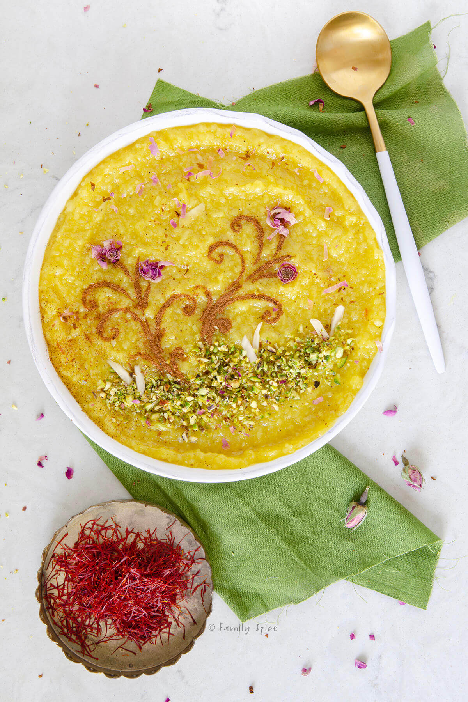

# Sholeh Zard

*Persian saffron rice pudding: short-grain rice slow-cooked with sugar, saffron and rosewater into a custardy yellow pudding, then chilled and decorated with cinnamon and pistachios in patterns. Eaten at religious commemorations and Nowruz; the colour and aroma matter as much as the taste.*

**Serves:** 6

**Prep Time:** 15 minutes

**Cook Time:** 1¼ hours

## Overview
Rice cooks slowly in lots of water until tender and mashable. Sugar dissolves with bloomed saffron; the lot simmers until thick — like loose porridge. Rosewater and a knob of butter join near the end; the pudding pours into shallow dishes to set. Cinnamon dust and pistachio patterns top each serving.

## Ingredients

- 200 g short or medium-grain white rice (rinsed)
- 1.5 litres water
- 350 g caster sugar
- A generous pinch of saffron (steeped in 4 tablespoons hot water 15 min)
- 50 g unsalted butter
- 3 tablespoons rosewater
- ½ teaspoon ground cardamom
- 50 g flaked almonds (toasted)

### To finish
- Ground cinnamon (for dusting)
- 50 g pistachios (chopped)
- A few rose petals (optional)

## Method

### Stage 1 – Cook the rice
1. Combine the rice and water in a large heavy pan.
1. Bring to a steady boil; reduce to a simmer; cook uncovered, stirring occasionally, 35-40 minutes until the rice has completely broken down and the mixture is thick and creamy.
1. Top up with hot water if it tightens too much.

### Stage 2 – Sweeten and saffron
1. Add the sugar and the saffron-water; stir well.
1. Continue cooking 25-30 minutes more, stirring often, until the pudding is thick — when a spoon drawn through leaves a clear path that fills slowly.

### Stage 3 – Finish
1. Stir in the butter, rosewater and cardamom.
1. Cook 5 minutes more; the pudding should be glossy and a deep saffron yellow.
1. Stir in the toasted almonds.

### Stage 4 – Set
1. Pour into 6 individual shallow bowls or one wide platter.
1. Cool slightly; refrigerate at least 2 hours to set.

### Stage 5 – Decorate and serve
1. Just before serving, dust the top with ground cinnamon — traditionally in patterns or stripes.
1. Sprinkle pistachios and rose petals.
1. Serve cold or at room temperature.

## Notes
- **Stir often after sugar:** Sugar makes the pudding catch on the bottom; stirring prevents a burnt base.
- **Saffron quality:** Iranian saffron threads (sargol or super negin) give the deepest yellow and most aroma. Cheap saffron tastes thin.
- **Set thick, not solid:** Sholeh zard should hold its shape when scooped but still be soft and creamy. Cooking too long gives a dense, sliceable result.

## Storage
- Keeps 4 days refrigerated; eats well cold.
