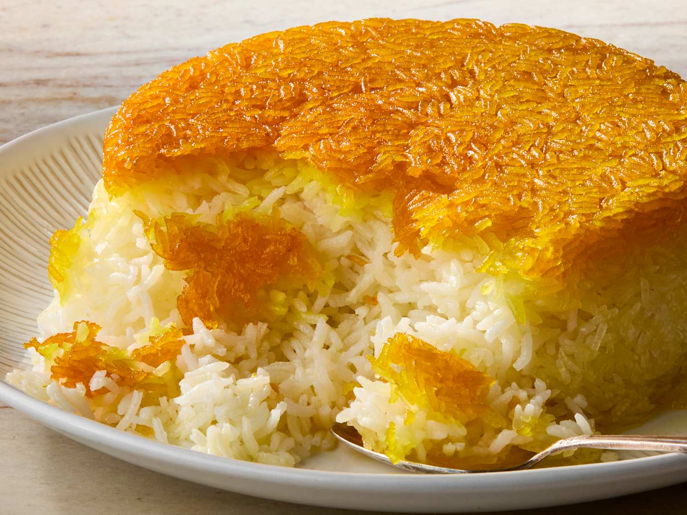

# Tahdig

*Persia's signature crispy rice "bottom of the pot": basmati rice cooked first by parboiling, then steamed in a heavy pan with butter and oil, the bottom layer left to crisp into a deep-golden, shatteringly crunchy crust. The diner's contest at every Iranian dinner is who gets the most tahdig.*

**Serves:** 4-6

**Prep Time:** 10 minutes (plus 1 hour rice soak)

**Cook Time:** 1 hour

## Overview
Basmati rice is rinsed and soaked. It parboils briefly in salted water (al dente), drains. The pot heats with butter, oil and saffron-water. A layer of yogurt-and-rice mixture forms the crust at the bottom; the rest of the rice piles on top in a mound. The lid wraps in a tea towel; everything steams 45 minutes; the bottom crisps. Inverted onto a platter, the golden tahdig sits on top.

## Ingredients

- 500 g basmati rice
- 2 tablespoons salt (for the parboiling water)
- 4 tablespoons unsalted butter
- 4 tablespoons vegetable oil
- A generous pinch of saffron (steeped in 3 tablespoons hot water 10 min)
- 4 tablespoons plain yogurt
- 1 large egg yolk

## Method

### Stage 1 – Soak
1. Rinse the rice well in several changes of water until the water runs almost clear.
1. Soak in cold salted water at least 1 hour (longer is fine, up to overnight).

### Stage 2 – Parboil
1. Bring 2.5 litres of water to a vigorous boil with the salt.
1. Drain the soaked rice; tip into the boiling water.
1. Cook 5-6 minutes — the rice should be al dente: bendy but still firm at the centre. Bite to test.
1. Drain quickly; rinse with cold water to stop cooking.

### Stage 3 – Build the crust
1. Mix the yogurt, egg yolk, half the saffron-water, 2 tablespoons of the parboiled rice and a pinch of salt in a bowl.
1. Heat the butter and oil in a wide heavy non-stick pan (24 cm) over medium heat until the butter melts.
1. Spread the yogurt-rice mixture evenly across the bottom of the pan.

### Stage 4 – Pile rice
1. Pile the rest of the parboiled rice on top in a pyramid (high in the centre, sloping at the edges — this allows steam to circulate).
1. Make 4-5 holes through the pile with the handle of a wooden spoon.
1. Drizzle the remaining saffron-water over.

### Stage 5 – Steam
1. Cover the lid with a clean tea towel (gathered up over the top of the lid; it absorbs steam — gives drier, fluffier rice).
1. Cook over medium-high heat 8-10 minutes until you hear sizzling and see steam.
1. Reduce the heat to lowest; cook 35-40 minutes more.

### Stage 6 – Invert
1. Remove from heat; leave covered 5 minutes.
1. Run a spatula around the edge.
1. Place a wide platter over the pan; flip in one swift motion.
1. The tahdig crust should release as a single golden disc on top.

### Stage 7 – Serve
1. Eat immediately while the crust is still crisp.
1. Pair with a Persian stew (fesenjan, ghormeh sabzi).

## Notes
- **Parboil al dente only:** Fully-cooked rice falls apart in the steam stage. Bend test: rice should bend but resist when pressed.
- **Tea towel under the lid:** Iranian standard technique. Keeps drips off the rice; gives drier, lighter grains.
- **Don't peek during the steam:** Lifting the lid drops the temperature and the crust softens.

## Storage
- Best fresh; the crust softens within hours. Reheats poorly.
