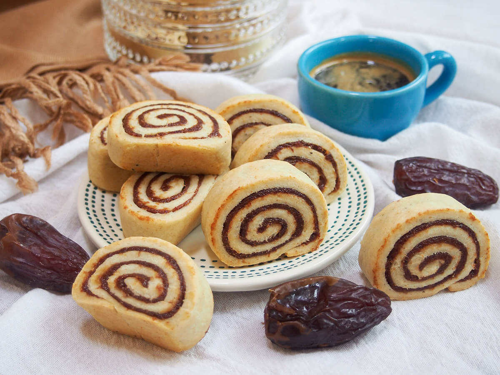

# Klaicha

*Iraq's national pastry: small filled cookies of cardamom-scented dough, traditionally stuffed with a date paste or with chopped walnuts and sugar. Eaten across Eid al-Fitr, weddings and family gatherings; the patterns pressed into the surface are personal and signature, often with a klaicha cutter passed down through generations.*

**Makes:** 30 cookies

**Prep Time:** 45 minutes (plus 30 min resting)

**Cook Time:** 25 minutes

## Overview
A buttery cardamom-scented dough enriched with milk and a touch of yeast (gives a tender bite without rising). Date paste sweetens with cardamom, cloves and a pinch of cinnamon. Each cookie wraps a teaspoon of filling, then gets pressed into a patterned mould or scored on top. Bakes pale gold; the surface stays soft, the inside spice-heavy.

## Ingredients

### Dough
- 500 g plain flour
- 200 g unsalted butter (softened)
- 100 g caster sugar
- 1 teaspoon ground cardamom
- ½ teaspoon ground nigella seeds (optional but classic)
- 1 teaspoon active dry yeast
- 200 ml whole milk (warm)
- 1 large egg
- ¼ teaspoon salt

### Date filling
- 400 g pitted dates (chopped)
- 50 g unsalted butter
- 1 teaspoon ground cardamom
- ½ teaspoon ground cloves
- ½ teaspoon ground cinnamon
- 2 tablespoons sesame seeds (optional)

### Glaze
- 1 large egg yolk (beaten with 1 tablespoon milk)
- 1 tablespoon sesame seeds

## Method

### Stage 1 – Date filling
1. Combine the dates, butter, cardamom, cloves and cinnamon in a small heavy pan.
1. Cook over low heat 5-8 minutes, mashing with a fork, until the dates are soft and the mixture is a smooth thick paste.
1. Stir in the sesame seeds (if using). Cool.

### Stage 2 – Dough
1. Whisk the warm milk with the yeast and a pinch of sugar; rest 5 minutes until frothy.
1. Cream the butter with the sugar in a large bowl.
1. Add the cardamom, nigella, salt and egg; mix.
1. Add the milk-yeast mixture; mix.
1. Add the flour gradually; mix to a soft, smooth dough (don't over-knead — just bring it together).
1. Cover and rest 30 minutes.

### Stage 3 – Shape
1. Heat the oven to 180°C (160°C fan).
1. Divide the dough into 30 walnut-sized balls.
1. Flatten each into a 7-8 cm disc on a floured surface.
1. Place a teaspoon of date paste in the centre.
1. Bring the edges up and over the filling; pinch closed.
1. Roll into a smooth ball, then flatten gently to a 4 cm thick disc.
1. Press a klaicha mould onto the smooth side (or score with the back of a fork or knife in a decorative pattern).

### Stage 4 – Bake
1. Place on lined baking sheets, 3 cm apart.
1. Brush with the egg yolk glaze; sprinkle with sesame seeds.
1. Bake 18-22 minutes until pale gold (not browned — Iraqi klaicha stay light).

### Stage 5 – Cool
1. Cool on a wire rack.
1. Eat warm or at room temperature with tea.

## Notes
- **Date paste consistency:** Should be soft and spreadable, not stiff. Add a splash of milk if too dry.
- **Pale, not golden:** Klaicha are baked light. Deep golden tops mean overbaked, dry cookies.
- **Walnut filling alternative:** Mix 200 g chopped walnuts, 100 g sugar, 1 teaspoon cardamom and 1 tablespoon rosewater for a nut-filled klaicha.

## Storage
- Keeps 2 weeks in an airtight tin; flavour deepens in the first few days.
- Freezes 2 months.
