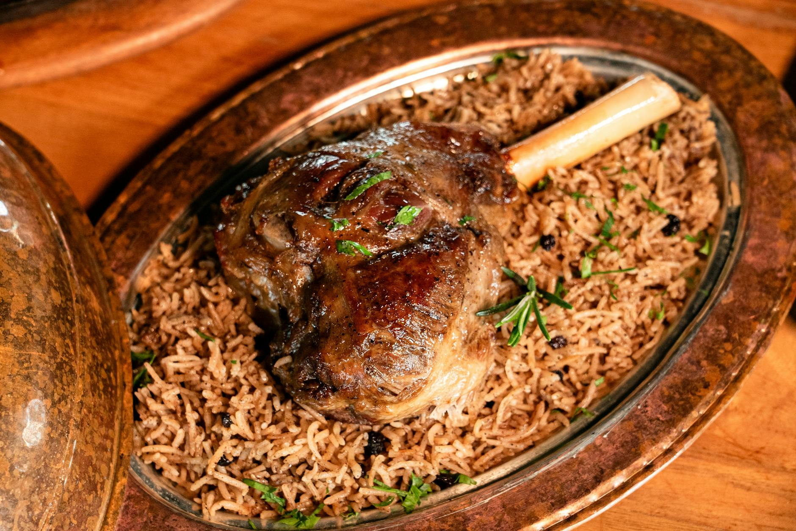

# Quzi

*Iraq's national feast dish: slow-roasted whole lamb (or shoulder) on a mountain of saffron rice, studded with raisins, almonds and pine nuts, often dressed with a thin tomato-and-spice sauce. Served at weddings, holidays, and large family meals; the lamb's juices flavour the rice underneath.*

**Serves:** 6-8

**Prep Time:** 30 minutes

**Cook Time:** 4 hours

## Overview
A bone-in lamb shoulder rubs with baharat, dried lime, garlic and yogurt; sits overnight; roasts long and slow until the meat falls from the bone. Saffron rice cooks separately with onion, raisins and toasted nuts. Everything assembles on a wide platter — rice mounded under the lamb, sauce spooned over, almonds and pine nuts scattered.

## Ingredients

### Lamb
- 2 kg lamb shoulder (bone-in)
- 4 tablespoons plain yogurt
- 8 garlic cloves (crushed)
- 2 tablespoons baharat (or 1 tsp each cumin, coriander, paprika, cinnamon, allspice + ½ tsp cardamom)
- 1 tablespoon ground turmeric
- 2 dried limes (loomi; pierced)
- 2 tablespoons olive oil
- 1 tablespoon salt
- 500 ml lamb stock or water (for the roasting tin)

### Rice
- 500 g basmati rice (rinsed)
- 50 g unsalted butter
- 2 tablespoons olive oil
- 2 large onions (finely chopped)
- 1 teaspoon cumin seeds
- 1 cinnamon stick
- 6 cardamom pods
- 4 cloves
- 2 bay leaves
- A generous pinch saffron (steeped in 3 tablespoons hot water 10 min)
- 1 litre hot water
- 1 teaspoon salt

### Topping
- 100 g flaked almonds
- 50 g pine nuts
- 100 g raisins (soaked in hot water 10 min, drained)
- 30 g unsalted butter

### Sauce (optional)
- 2 tablespoons tomato paste
- 1 garlic clove (crushed)
- 200 ml lamb cooking liquid
- 1 teaspoon baharat
- 1 tablespoon lemon juice

## Method

### Stage 1 – Marinate the lamb (the day before)
1. Whisk the yogurt with the garlic, baharat, turmeric, oil and salt.
1. Rub all over the lamb shoulder; pierce the meat with a knife in several places.
1. Cover; refrigerate overnight.

### Stage 2 – Roast
1. Heat the oven to 160°C (140°C fan).
1. Place the lamb in a deep roasting tin; tuck the dried limes underneath.
1. Pour the stock into the tin.
1. Cover tightly with foil; roast 3-3½ hours until the meat falls from the bone.
1. Remove the foil; raise the heat to 220°C (200°C fan); roast 20-25 minutes more to brown the surface.
1. Lift the lamb to a platter; rest covered.

### Stage 3 – Reduce the cooking liquid
1. Skim the fat from the tin liquid; pour into a pan.
1. Reduce by half; reserve as a sauce base.

### Stage 4 – Rice
1. Melt the butter in the oil in a heavy pan over medium heat.
1. Cook the onions 8 minutes until golden.
1. Add the cumin seeds, cinnamon, cardamom, cloves and bay leaves; cook 1 minute.
1. Add the rice; toast 2 minutes.
1. Pour in the hot water, saffron-water and salt.
1. Bring to the boil; reduce to lowest heat; cover; cook 15 minutes.
1. Off the heat, rest covered 10 minutes; fluff.

### Stage 5 – Toppings
1. Cook the almonds and pine nuts in 30 g butter until golden; lift onto kitchen paper.
1. Drain and toss the soaked raisins in the same pan briefly.

### Stage 6 – Sauce (optional)
1. Combine the tomato paste, garlic, reduced cooking liquid, baharat and lemon juice in a small pan.
1. Simmer 5 minutes.

### Stage 7 – Plate
1. Mound the rice on a wide platter.
1. Place the lamb on top.
1. Scatter raisins, almonds and pine nuts over.
1. Spoon the sauce over the lamb.
1. Serve with yogurt and Arabic salad on the side.

## Notes
- **Dried lime (loomi) is essential:** Sold whole at Middle Eastern grocers; lemon juice is no substitute. Pierce so the flavour leaches out.
- **Marinate overnight:** The yogurt tenderises and the spices penetrate. Same-day quzi is half the dish.
- **Slow then fast:** Long covered roast for tenderness; short uncovered blast for the surface. Don't skip the second part.

## Storage
- Keeps 3 days refrigerated. Reheat covered at 160°C with a splash of water.
- Freezes 3 months.
