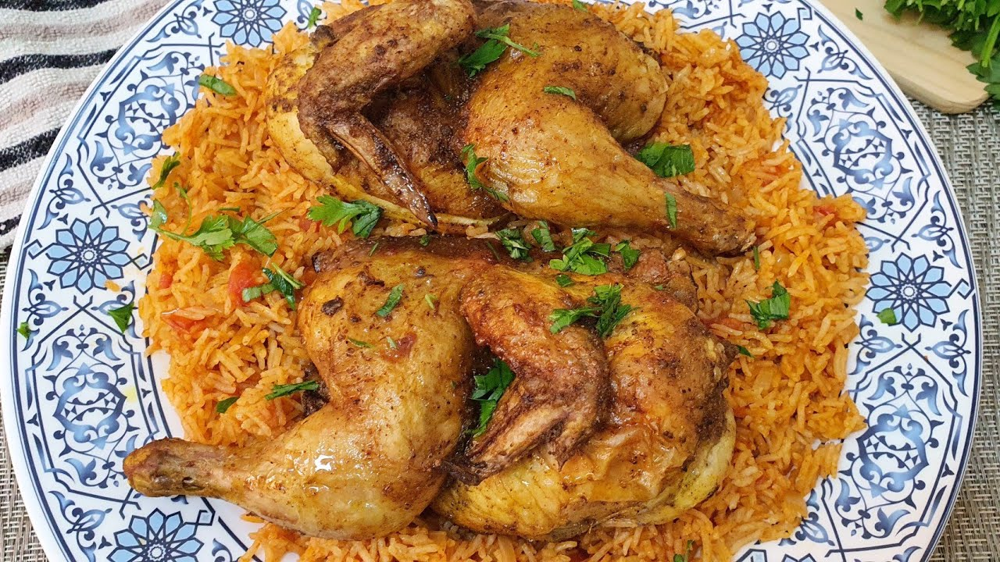

# Timman Ahmar

*Iraqi red rice: long-grain rice cooked with tomato paste, onion, baharat and a touch of cinnamon, often topped with crispy fried potato slices. The rice goes orange-red from the tomato; the bottom of the pot turns into a hidden golden crust (hkake), the prize. Served alongside meat, fish or stew.*

**Serves:** 4-6

**Prep Time:** 10 minutes

**Cook Time:** 35 minutes

## Overview
Onion softens in oil; tomato paste fries until darker and aromatic; rice toasts briefly; hot stock pours in with baharat and cinnamon. Sliced potatoes layer at the bottom of the pot for the crust; rice piles over; the lot steams covered until tender. The crust pops out at the end as a single golden cake.

## Ingredients

- 500 g basmati rice (rinsed and soaked 30 minutes)
- 4 tablespoons vegetable oil
- 1 large onion (finely chopped)
- 4 garlic cloves (crushed)
- 4 tablespoons tomato paste
- 1½ teaspoons baharat
- 1 teaspoon ground cumin
- ½ teaspoon ground cinnamon
- ½ teaspoon turmeric
- 1.1 litres hot water (or chicken/lamb stock)
- 1½ teaspoons salt
- 2 medium potatoes (sliced 5 mm thick rounds)
- 2 tablespoons unsalted butter

### Topping
- A small bunch of flat-leaf parsley (chopped)
- 30 g toasted almonds (optional)

## Method

### Stage 1 – Sofrito base
1. Heat 2 tablespoons of the oil in a heavy lidded pot over medium heat.
1. Cook the onion 6-8 minutes until golden.
1. Add the garlic; cook 1 minute.
1. Stir in the tomato paste, baharat, cumin, cinnamon and turmeric; cook 2-3 minutes — the paste will darken.
1. Tip into a bowl; clean the pot.

### Stage 2 – Potato crust
1. Heat the remaining 2 tablespoons of oil in the cleaned pot over medium heat.
1. Lay the potato slices flat in a single layer to cover the bottom (overlap slightly if needed).
1. Salt lightly; cook 4-5 minutes — they should start to colour but not burn.

### Stage 3 – Build
1. Drain the rice; mix with the tomato-onion mixture.
1. Pour the hot water and salt into the pot (over the potatoes).
1. Pile the rice mixture in evenly; smooth the top.
1. Dot with the butter.

### Stage 4 – Cook
1. Bring to a steady simmer.
1. Reduce the heat to lowest; cover with the lid (place a clean tea towel under the lid to absorb steam if you have one).
1. Cook 22-25 minutes without lifting the lid.
1. Off the heat, rest covered 10 more minutes.

### Stage 5 – Invert
1. Run a spatula around the edges to loosen.
1. Invert onto a wide serving plate — the potato crust should come out on top, golden and intact.
1. Top with parsley and almonds.

### Stage 6 – Serve
1. Cut wedges to expose the crust on top of each portion.
1. Serve with grilled lamb, chicken or stewed beans.

## Notes
- **Tea towel under lid:** Standard Iraqi technique to absorb steam; gives drier rice and a crispier potato base.
- **Don't lift the lid:** Steam is what cooks the rice through. Set a timer; trust.
- **Potato thickness:** 5 mm gives a tender, chewy crust; thinner burns; thicker stays raw.

## Storage
- Best fresh; the crust softens on reheat. Keeps 3 days refrigerated; reheat in an oven at 180°C for 15 minutes covered.
