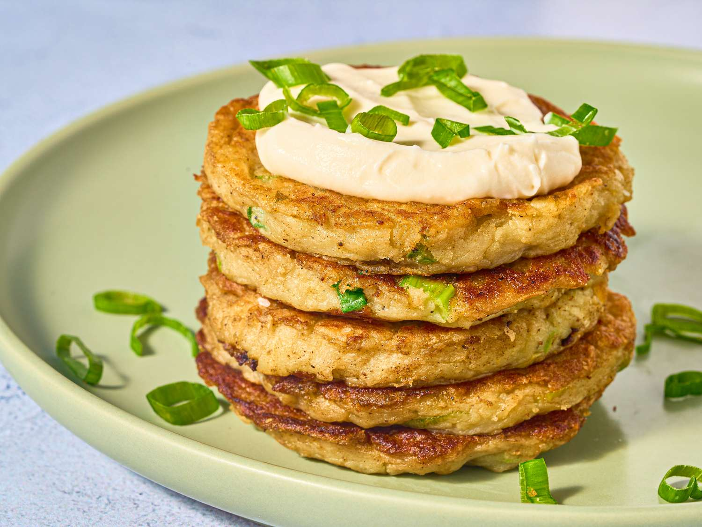

# Boxty

*Irish potato pancakes built on a 50/50 mix of grated raw and mashed cooked potatoes — the raw gives a chewy, almost fritter-like body; the mash gives smoothness. Eats hot off the pan with butter, an egg, or rolled around a savoury filling.*

**Makes:** 8 small pancakes

**Prep Time:** 20 minutes

**Cook Time:** 15 minutes

## Overview
Half the potatoes are boiled and mashed; the other half are grated raw and squeezed dry. Both fold together with flour, milk and an egg into a thick batter. Spoonfuls fry in butter until deep golden on both sides.

## Ingredients

- 250 g floury potatoes (peeled and cubed)
- 250 g floury potatoes (peeled, for grating)
- 100 g plain flour
- 1 teaspoon baking powder
- 1 large egg
- 100 ml whole milk
- 1 teaspoon salt
- Black pepper
- 50 g unsalted butter (for frying; plus more to serve)

## Method

### Stage 1 – Mash half
1. Boil the cubed potatoes in salted water 12-15 minutes until tender; drain; mash; cool slightly.

### Stage 2 – Grate the other half
1. Coarsely grate the remaining peeled potatoes.
1. Pile the grated potato into a clean tea towel; twist hard over the sink to wring out as much liquid as possible — you want the grated potato dry-ish.

### Stage 3 – Mix
1. Combine the mash, grated potato, flour, baking powder, egg, milk, salt and black pepper in a bowl. Stir to a thick, lumpy batter — should hold its shape on a spoon.
1. Rest 10 minutes (lets the flour hydrate).

### Stage 4 – Fry
1. Heat half the butter in a wide frying pan over medium heat.
1. Drop heaped tablespoons of batter into the pan; flatten gently with the back of the spoon to 1 cm thick.
1. Cook 4-5 minutes per side until deep golden and crisp; the inside should be cooked through (test with a knife).
1. Cook in 2-3 batches; add more butter as needed.

### Stage 5 – Serve
1. Eat hot off the pan with butter, a fried egg, or smoked salmon for a more substantial meal.

## Notes
- **Wring the grated potato:** Damp grated potato makes soggy boxty. The drier you can get it, the better the fritter texture.
- **Floury potatoes:** Waxy ones don't break down for the mash and don't bind the grated potato.
- **Heat control:** Too hot and the outside burns before the inside cooks. Medium heat; flip once they're properly golden.

## Storage
- Best eaten hot. Leftovers refrigerate 2 days; re-fry in butter to restore the crisp.
