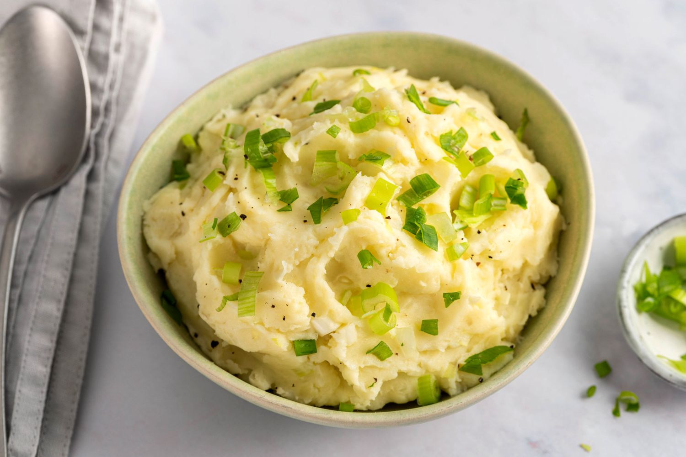

# Champ

*Mashed potatoes folded through with finely-sliced spring onions that have been steeped in hot milk. The milk goes onion-mild and herbal; the mash takes that flavour, gets generous butter, and is served with a well of melted butter pooling in the middle. Northern Ireland's everyday potato dish.*

**Serves:** 4

**Prep Time:** 5 minutes

**Cook Time:** 25 minutes

## Overview
Spring onions infuse hot milk for 10 minutes off the heat. Floury potatoes boil and dry; everything mashes together with a generous amount of butter. The classic finish: a hollow scooped out of the centre of the mound on each plate, filled with melting butter.

## Ingredients

- 1 kg floury potatoes (Maris Piper, King Edward; peeled and cubed)
- 250 ml whole milk
- 1 large bunch spring onions (12-14; thinly sliced, white and green parts)
- 100 g unsalted butter (plus more to serve)
- Salt and white pepper

## Method

### Stage 1 – Steep the milk
1. Put the milk and spring onions in a small pan; bring just to a simmer.
1. Off the heat, cover and rest 10 minutes — the onions soften and infuse the milk.

### Stage 2 – Potatoes
1. Boil the potatoes in salted water 15-18 minutes until completely tender.
1. Drain; return to the dry pan; cover with a tea towel for 5 minutes.

### Stage 3 – Mash
1. Add 80 g of the butter to the potatoes; mash until smooth.
1. Pour in the warm milk and spring onions; stir to combine.
1. Season generously with salt and white pepper.

### Stage 4 – Serve
1. Pile into individual bowls or one big bowl.
1. Press a deep well in the centre with the back of a spoon.
1. Drop a knob of butter into the well; let it melt.
1. Eat by working the butter outward from the centre.

## Notes
- **Don't boil the milk:** A simmer extracts the onion flavour without scalding. Keep the heat low.
- **Generous butter:** Champ is butter-forward. Anything less than 80 g feels mean.
- **Mash texture:** Should be smooth, not gluey. Use a potato ricer or a hand masher; avoid food processors.

## Storage
- Best fresh. Leftover champ refrigerates 2 days; reheat in a buttered pan with a splash of milk.
