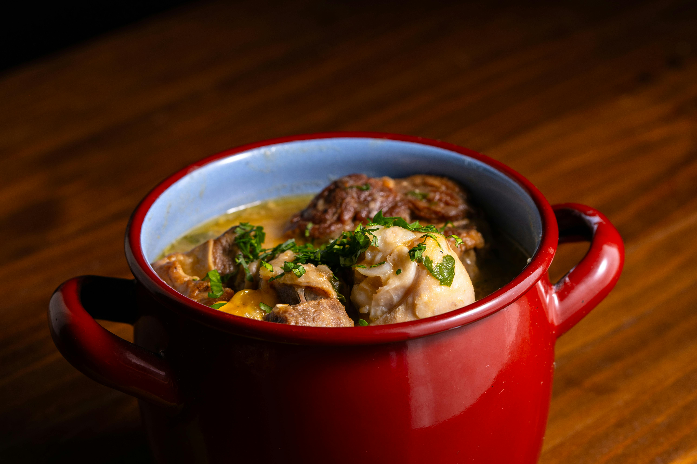

# Irish Stew

*This humble yet deeply satisfying stew is a cornerstone of Irish cooking: lamb, potatoes, and onions combine in the simplest way to create something far greater than the sum of its parts. It requires patience but not precision, comfort food at its finest.*

**Serves:** 4

## Overview
Irish stew is the epitome of rustic, peasant cooking elevated to comfort food status. Middle neck of lamb simmers gently with potatoes, onions, carrots, and cabbage in a light broth, with the potatoes gradually breaking down to thicken the sauce naturally. The result is a one-pot wonder that's wholesome, deeply flavorful, and warming, the kind of dish that feeds both body and soul on cold days.

## Ingredients

### Meat & Base
- 750 grams middle neck of lamb (cut into chunks)
- 100 grams butter
- 1.5 litres chicken stock
- 1 bouquet garni
- 1 garlic clove
- Salt and freshly ground black pepper to taste

### Vegetables
- 4 onions (sliced)
- 450 grams potatoes (peeled and cut into 2 cm dice)
- 175 grams carrots (diced)
- 6 celery sticks (cut into 2 cm dice)
- 225 grams savoy cabbage (shredded)

### Garnish
- 2 teaspoons parsley (freshly chopped)

## Method

### Stage 1 – Blanch Lamb
1. Place lamb with cold water in a large pan and bring to the boil.
2. As soon as the water reaches a boil, drain and refresh the lamb under cold water. Drain well.
3. This removes impurities and ensures a clear broth.

### Stage 2 – Begin Stew
1. Melt butter in a large braising pan and add sliced onions, half the diced potatoes, and the garlic.
2. Add the bouquet garni and sweat gently for 2 minutes.
3. Add the blanched lamb and cover with chicken stock.
4. Bring to a simmer, cover, and cook for 30 minutes.

### Stage 3 – Add Root Vegetables
1. After 30 minutes, the meat should be half-cooked and some potatoes will have begun to break down and thicken the stock naturally.
2. Add diced carrots and cook for a further 10 minutes.
3. Add the remaining potatoes and diced celery; cook for 15-20 minutes until potatoes are soft but not completely pureed (some firmness should remain).

### Stage 4 – Finish & Serve
1. Add the shredded cabbage and cook for another 2-3 minutes until all vegetables and meat are tender.
2. Taste and season carefully with salt and pepper.
3. Remove the bouquet garni.
4. Serve immediately in deep bowls, topped with fresh chopped parsley.

## Notes
- **Blanching the Lamb:** This initial blanching clears the broth of impurities, creating a clearer, more refined stock.
- **Potato Thickening:** Adding potatoes in two stages, half early to thicken, half later to retain texture, creates the ideal consistency.
- **Vegetable Timing:** Each vegetable is added at a precise moment to ensure proper doneness; carrots enter first due to longer cooking time.
- **Natural Thickening:** Resist the urge to over-mash; the stew should have a rustic, chunky texture with just enough broken potatoes to thicken the broth.

## Variations
**Pearl Barley Version:** Substitute 75g pearl barley for the celery for a heartier, more substantial stew.
**Summer Variation:** Replace cabbage with fresh spring greens and add fresh peas in the final minutes.
**Modern Irish:** Include 2 bay leaves and 2 teaspoons fresh thyme for added herbaceous depth.

## Serving
Serve with: Thick crusty bread for soaking up the broth, or colcannon (mashed potatoes with cabbage)
Garnish with: Fresh flat-leaf parsley and a light grinding of black pepper

## Storage
- Keeps 4-5 days refrigerated; flavors actually improve after 24 hours
- Freezes well up to 3 months (the potatoes may soften slightly upon reheating)
- Best served hot and piping; reheat gently to avoid breaking apart the tender meat
