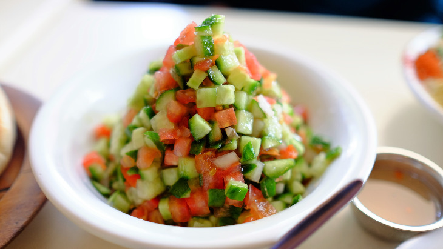

# Israeli Salad

*Salat Katzutz: cucumber, tomato, onion and parsley diced very small and dressed with lemon, olive oil and salt. Eaten morning, noon and night across Israel — at breakfast next to eggs and labneh, at lunch beside grilled meat, at dinner in pita. The size of the dice is the dish; everything finer than 5 mm.*

**Serves:** 4

**Prep Time:** 15 minutes

**Cook Time:** 0 minutes

## Overview
Vegetables are diced into uniform 5 mm cubes — knife work matters. Lemon juice, olive oil and salt are the only dressing; sometimes a teaspoon of sumac or a clove of crushed garlic. Eaten freshly made; doesn't keep — the cucumbers weep.

## Ingredients

- 4 medium tomatoes (around 400 g; cores cut out)
- 2 medium cucumbers (around 350 g)
- 1 small red onion
- 1 small green pepper (optional)
- A small bunch of flat-leaf parsley (chopped)
- A small bunch of mint (chopped, optional)
- 4 tablespoons extra-virgin olive oil
- Juice of 1 large lemon (around 3 tablespoons)
- 1 teaspoon salt
- ½ teaspoon black pepper
- ½ teaspoon ground sumac (optional)

## Method

### Stage 1 – Dice
1. Halve the tomatoes; scoop out and discard the seeds and watery cores; dice the flesh into 5 mm cubes.
1. Peel the cucumbers (or stripe them); halve lengthwise; scoop out the seeds; dice to match.
1. Dice the red onion to match.
1. If using, deseed and dice the green pepper.

### Stage 2 – Combine
1. Tip everything into a wide bowl.
1. Add the parsley, mint, olive oil, lemon juice, salt, pepper and sumac.
1. Toss gently.

### Stage 3 – Rest briefly and serve
1. Rest 5-10 minutes (the salt draws a little juice; the dressing settles).
1. Stir once; taste; adjust salt and lemon.
1. Serve at room temperature alongside grilled meat, falafel, or eggs.

## Notes
- **Deseed the tomatoes and cucumbers:** Wet seeds water down the dressing; the salad goes from crisp to soggy in an hour. Cut them out.
- **Knife dice, not blender:** A food processor turns this into salsa. The texture of clean small cubes is the point.
- **Eat fresh:** Won't keep beyond a few hours. Make at the table or just before serving.

## Storage
- Best within 2 hours of mixing.
