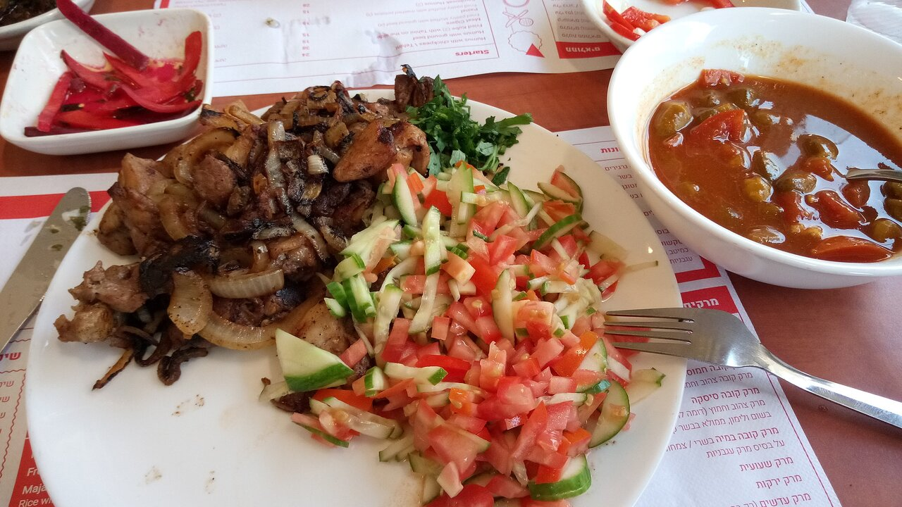

# Jerusalem Mixed Grill

*Me'orav Yerushalmi: a fast, hot griddle of chicken livers, hearts and thigh meat with onions, cumin, turmeric and black pepper, stuffed into pita with hummus, pickles and tahini. Born of the Mahane Yehuda market in the 1970s; eats hot, dripping, and one-handed.*

**Serves:** 4

**Prep Time:** 20 minutes

**Cook Time:** 20 minutes

## Overview
Chicken thigh, liver and heart sear hard in a wide pan with onions; spices bloom; everything cooks together until the meat is just done and the onions are deeply caramelised. Stuffed into pita with hummus, salad, tahini, pickles. The signature is the spice blend — cumin, turmeric, paprika, black pepper, cardamom — and the onion-to-meat ratio (a lot of onion).

## Ingredients

- 400 g boneless chicken thighs (cut into 1.5 cm strips)
- 200 g chicken livers (trimmed, cut in half)
- 200 g chicken hearts (cleaned, halved)
- 4 large onions (sliced)
- 4 tablespoons vegetable oil
- 2 teaspoons ground cumin
- 1½ teaspoons ground turmeric
- 1 teaspoon sweet paprika
- 1 teaspoon ground black pepper
- ½ teaspoon ground cardamom
- ½ teaspoon ground cinnamon
- 1½ teaspoons salt
- Juice of 1 lemon

### To serve
- 4 pita breads (warmed)
- 200 g hummus
- Tahini sauce
- Pickled cucumbers
- Sliced tomato and onion
- Hot sauce (zhug or harissa)

## Method

### Stage 1 – Onions
1. Heat 2 tablespoons oil in a wide heavy pan over medium-high heat.
1. Cook the onions 12-15 minutes, stirring, until deep golden.

### Stage 2 – Meat
1. Push onions to one side; add the remaining oil.
1. Add the thigh meat; sear 4-5 minutes until coloured.
1. Add the livers and hearts; sear 3-4 minutes more.

### Stage 3 – Spice
1. Sprinkle in all the spices and salt.
1. Toss everything together; cook 2-3 minutes more so the spices coat and the livers are just-cooked through (still pink at the centre is fine — they shouldn't be dry).

### Stage 4 – Finish
1. Off the heat, squeeze in the lemon juice.

### Stage 5 – Serve
1. Stuff into warm pita with hummus, tahini, pickles and salad.
1. Pass hot sauce at the table.

## Notes
- **Don't overcook the livers:** They should be just-set, slightly pink in the centre. Cooked through and they go grainy.
- **Lots of onion:** The onion-to-meat ratio is high in proper me'orav. Don't reduce it.
- **Spice blend:** Cumin, turmeric and black pepper are the backbone; the others tune the warmth.

## Storage
- Best fresh; reheats poorly.
