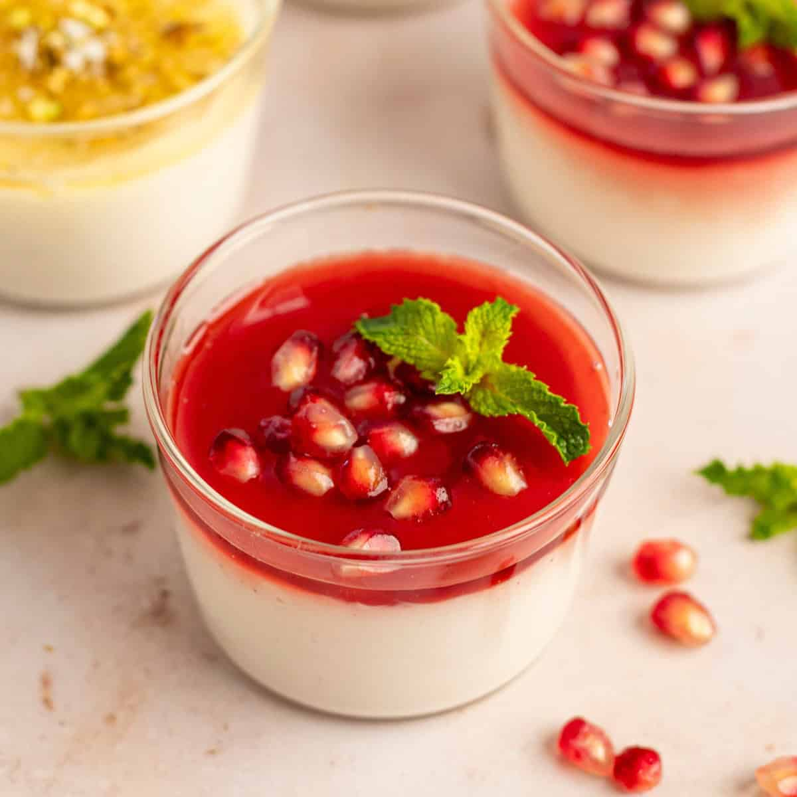

# Malabi

*A silky milk pudding scented with rosewater, set with cornflour, topped with a rose-and-rosewater syrup and crushed pistachios. Eaten across Israel, Lebanon, Turkey and the Levant under different names; this is the bright pink, market-stand version sold in plastic cups across Tel Aviv.*

**Serves:** 6

**Prep Time:** 10 minutes

**Cook Time:** 15 minutes (plus 3 hours setting)

## Overview
Cornflour whisks into a small amount of cold milk to a slurry. The rest of the milk warms with cream and sugar; the slurry pours in; the mixture cooks 4-5 minutes until thick and silky. Rosewater stirs in off the heat; the lot pours into glasses to set in the fridge. The syrup of rosewater, sugar and a touch of grenadine pours over before serving.

## Ingredients

### Pudding
- 1 litre whole milk
- 200 ml double cream
- 100 g caster sugar
- 80 g cornflour
- 1 tablespoon rosewater
- ½ teaspoon vanilla extract

### Syrup
- 100 g caster sugar
- 100 ml water
- 2 tablespoons grenadine syrup (or pomegranate molasses)
- 1 tablespoon rosewater

### Topping
- 50 g pistachios (chopped)
- 2 tablespoons desiccated coconut
- A few rose petals (edible, optional)

## Method

### Stage 1 – Slurry
1. Whisk the cornflour with 200 ml of the cold milk in a bowl until completely smooth.

### Stage 2 – Heat
1. Combine the remaining 800 ml of milk, the cream and sugar in a heavy saucepan.
1. Heat over medium, stirring, until just beginning to simmer.

### Stage 3 – Thicken
1. Whisk in the cornflour slurry steadily.
1. Cook 4-5 minutes, whisking constantly, until thickened to a custard-like consistency.

### Stage 4 – Flavour
1. Off the heat, stir in the rosewater and vanilla.
1. Strain through a fine sieve into a jug (catches any lumps).

### Stage 5 – Set
1. Pour into 6 glasses or dessert bowls.
1. Cover and refrigerate at least 3 hours, ideally overnight.

### Stage 6 – Syrup
1. Combine the sugar and water in a small pan.
1. Simmer 5 minutes until slightly thickened.
1. Off the heat, stir in the grenadine and rosewater.
1. Cool fully.

### Stage 7 – Serve
1. Spoon the cooled syrup over each set malabi.
1. Top with chopped pistachios, coconut and rose petals.

## Notes
- **Strain after thickening:** Cornflour can leave small lumps; straining gives the silky texture you want.
- **Rosewater quality:** Some brands are perfumey, others delicate. Start with 2 teaspoons; taste; add more if needed.
- **Grenadine for the pink:** Authentic street malabi is bright pink from grenadine syrup. Skip and the dessert tastes the same but looks pale.

## Storage
- Keeps 3 days refrigerated. Top with syrup and nuts only just before serving.
