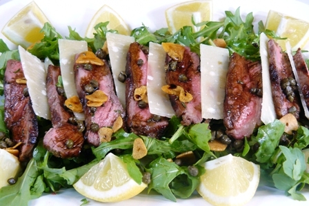

# Beef Tagliata

*Tagliata takes its name from tagliare, meaning 'to cut' in Italian. Perfectly seared steaks are sliced and served with peppery rocket and shavings of Parmesan, finished with a fragrant rosemary and lemon oil. This is simple, elegant, and demands quality ingredients and technique.*

**Serves:** 4

## Overview
Beef Tagliata is an elegant simplicity itself: thick-cut sirloin seared until a golden crust forms, rested to retain its juices, then sliced thin. The accompanying rosemary-infused oil with lemon zest and juice creates a sophisticated dressing that adds depth without heaviness, while peppery rocket and Parmesan shavings provide textural contrast. This is a dish that celebrates the quality of the beef and the importance of proper technique.

## Ingredients

### Steaks & Oil
- 2 sirloin steaks (approximately 400 grams each)
- Olive oil (for cooking)

### Rosemary Oil Dressing
- 120 ml extra virgin olive oil
- 3 garlic cloves (peeled and crushed)
- 4 sprigs fresh rosemary
- 1 lemon (zested and juiced)

### Garnish & Finishing
- 60 grams rocket leaves
- 40 grams Parmesan shavings
- Salt and freshly ground black pepper to taste

## Method

### Stage 1 – Sear Steaks
1. Place a heavy-bottomed frying pan over high heat and add a teaspoon of olive oil, heating until the pan begins to smoke.
2. Rub the steaks with olive oil to coat them evenly.
3. Place steaks in the hot pan and sear for 15-20 seconds without moving.
4. Turn and sear the other side for 15-20 seconds.
5. Continue turning and searing every 20-30 seconds for 2-3 minutes, depending on desired doneness (see Notes).
6. Remove steaks and place on a wire rack set over a plate to catch juices while resting.

### Stage 2 – Make Rosemary Oil
1. Remove the pan from heat and discard most of the oil.
2. Allow the pan to cool for a couple of minutes.
3. Pour in the 120 ml extra virgin olive oil.
4. Add the crushed garlic and rosemary sprigs.
5. Rub the lemon zest between your fingers to release the oils and add to the pan.
6. Allow to infuse for 5 minutes while the meat rests.
7. Add the lemon juice, mix well, then strain through a fine-meshed sieve.
8. Stir in the resting juices from the steak.

### Stage 3 – Slice & Assemble
1. Slice each steak thinly (approximately 5 mm wide) with a sharp knife, maintaining the slices in order.
2. Season the slices with salt and freshly ground pepper.
3. Arrange on a serving dish and spoon over half the rosemary oil dressing.
4. Toss the rocket leaves with the remaining dressing.
5. Arrange dressed rocket on top of the steak.
6. Finish with Parmesan shavings and a light sprinkling of sea salt crystals.

## Notes
- **Searing Technique:** A truly hot pan is essential, it creates the crust that keeps the juices inside. Rubbing the steak with oil rather than oiling the pan gives better control.
- **Salt Timing:** Season after searing, not before, which allows the juices to be reabsorbed during resting, adding flavor throughout the meat.
- **Doneness Levels:** Internal temperature, bleu 45°C, rare 50°C, medium-rare 55°C, medium 60°C, well-done 70°C. Use a meat thermometer for accuracy.
- **Resting:** This is crucial, it allows carryover cooking and juice redistribution throughout the meat.

## Variations
**With Balsamic:** Drizzle aged balsamic vinegar over the finished dish for additional depth.
**Hot Chilli Version:** Add a pinch of red chilli flakes to the rosemary oil for warmth.
**With Truffle Oil:** Finish with a few drops of truffle oil instead of plain olive oil for luxury.

## Serving
Serve with: Crusty bread, roasted potatoes, or a simple green salad
Garnish with: Fresh rocket, Parmesan shavings, and fleur de sel

## Storage
- Best served immediately while warm
- Not recommended for freezing due to texture sensitivity
- Leftover steak can be refrigerated up to 2 days and served cold as a salad component