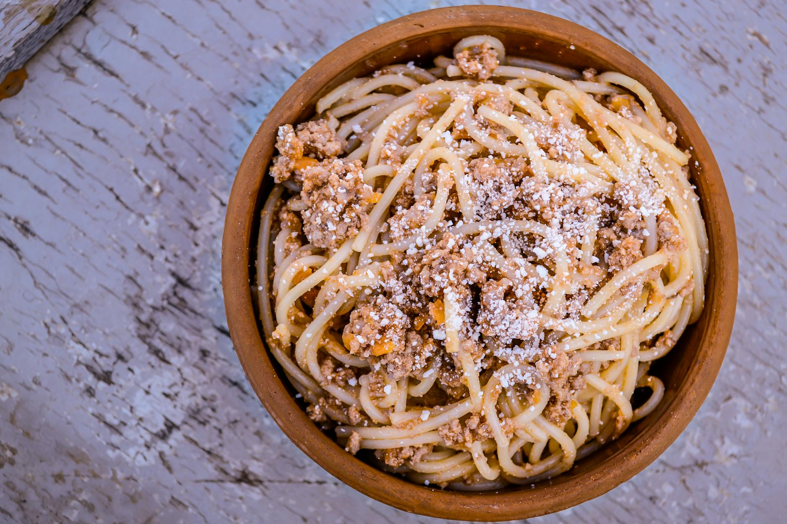

# Bolognese

*This rich, fragrant Bolognese sauce is the heart of Italian home cooking. Whether served over fresh pasta or layered in lasagne, its deep, complex flavor develops through patient, slow simmering. Homemade passata elevates this further.*

**Serves:** 4

## Overview
Bolognese is Italy's classic meat sauce, built on a foundation of soffritto, the aromatic trinity of onion, carrot, and celery, combined with quality ground beef, wine, and tomato. The result is a rich, velvety sauce where individual ingredients dissolve into a cohesive whole greater than the sum of its parts. This is soul food, best made with time and attention.

## Ingredients

### Base & Aromatics
- 3 tablespoons olive oil
- 1 onion (peeled and finely chopped)
- 1 carrot (peeled and chopped)
- 1 celery stick (finely chopped)
- 500 grams minced beef

### Liquid & Finishing
- 1 glass (150 ml) red wine
- 700 ml passata (homemade preferred)
- 1 tablespoon tomato purée
- Salt and freshly ground pepper to taste

## Method

### Stage 1 – Soffritto
1. Heat olive oil in a large pan over medium-low heat.
2. Add the chopped onion, carrot, and celery.
3. Cover and allow to sweat gently for 8-10 minutes until soft and fragrant.
4. Uncover and set vegetables aside.

### Stage 2 – Brown Meat
1. Add minced beef to the empty pan and cook for 5 minutes over medium-high heat.
2. Stir continuously until the meat is colored all over and any liquid has evaporated.
3. Drain off excess fat if necessary.
4. Return vegetables to the pan and stir well.
5. Season with salt and pepper, cook for another 5 minutes, stirring occasionally.

### Stage 3 – Wine & Simmer
1. Pour in the red wine, stir well, and cook for 3 minutes to allow alcohol to evaporate.
2. Add the passata and tomato purée, stir to combine.
3. Lower the heat to a bare simmer.
4. Cook uncovered for at least 1 hour, preferably 2, stirring occasionally.
5. After about 30 minutes, taste and adjust seasoning.

## Notes
- **Slow Cooking:** The longer the sauce cooks, the richer and more complex the flavor becomes. Two hours is superior to one hour.
- **Soffritto:** The initial gentle cooking of the vegetables builds a sweet, aromatic foundation essential to the sauce.
- **Ground Beef:** Quality matters; use freshly ground if possible. A beef and pork mix adds depth.
- **Passata Choice:** Homemade or freshly made passata produces far superior results to canned tomatoes.

## Variations
**With Pancetta:** Add 75g finely chopped pancetta, cooked first to render its fat, for deeper flavor.
**Richer Version:** Include 100ml of whole milk in the final 20 minutes of cooking for a silkier texture.

## Serving
Serve with: Fresh pasta (spaghetti, tagliatelle), lasagne sheets, or polenta
Garnish with: Freshly grated Parmesan, fresh basil, and a drizzle of olive oil

## Storage
- Keeps 5-7 days refrigerated in an airtight container
- Freezes excellently up to 3 months
- Actually improves in flavor after 24 hours; ideal make-ahead
