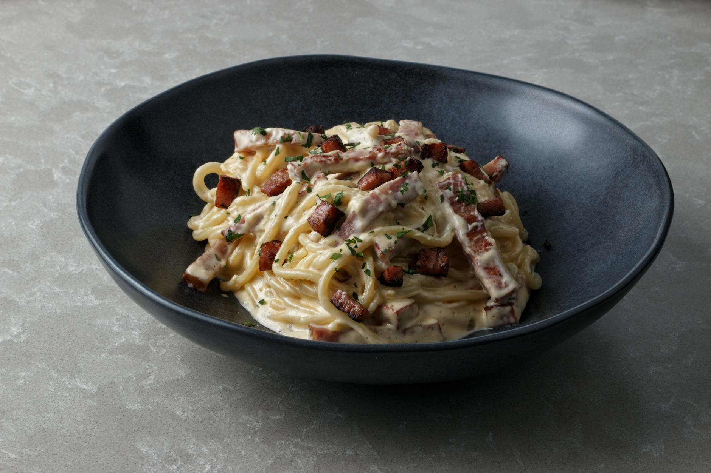

# Bucatini Carbonara

*Bucatini alla carbonara, one of Rome's great contributions to world cuisine. This classic dish uses no cream, a point of pride for Italians. The heat of the pasta cooks the eggs into a silken sauce, while pancetta provides smokiness and Pecorino Romano adds sharpness. Bucatini's hollow center allows the sauce to penetrate throughout.*

**Serves:** 4

## Overview
Bucatini Carbonara is a masterclass in simplicity and technique. Five ingredients, pasta, eggs, Pecorino Romano, pancetta, and salt, combine to create a rich, creamy sauce without any cream. The success lies in temperature control: hot pasta cooks the raw eggs to silken perfection without scrambling. This is Roman street food elevated to art.

## Ingredients

### Pancetta Base
- 250 grams smoked pancetta (cut into 5 mm strips)
- 3 tablespoons extra virgin olive oil
- 15 grams salted butter

### Egg Sauce
- 4 large eggs
- 4 tablespoons Pecorino Romano (freshly grated)
- Salt and freshly ground black pepper to taste

### Pasta & Garnish
- 500 grams bucatini
- 4 tablespoons fresh flat-leaf parsley (finely chopped)
- Additional Pecorino Romano for serving

## Method

### Stage 1 – Prepare Ingredients
1. Cut pancetta into short 5 mm strips.
2. In a bowl, whisk together eggs, half the Pecorino Romano, parsley, and five grinds of black pepper.
3. Set aside at room temperature.

### Stage 2 – Cook Pancetta
1. Heat oil and butter in a large frying pan over medium heat.
2. Add pancetta and fry for about 5 minutes until golden and crispy, stirring occasionally.
3. Remove from heat and set aside in the warm pan.

### Stage 3 – Cook Pasta
1. Cook bucatini in a large saucepan of boiling salted water until al dente.
2. Drain thoroughly, reserving a small cup of pasta water.

### Stage 4 – Combine & Finish
1. Tip hot pasta into the pan with the pancetta (off the heat).
2. Pour the egg mixture over the pasta.
3. Mix everything together vigorously for 30 seconds with a wooden spatula (the heat from the pasta will cook the egg into a silken sauce).
4. If the mixture seems too dry, add a splash of reserved pasta water and stir again.
5. Season with additional salt and pepper if needed.
6. Serve immediately in warmed bowls, topped with remaining Pecorino Romano.

## Notes
- **Temperature Control:** Never cook on heat after adding the eggs; direct heat scrambles the eggs. The residual heat of the hot pasta is sufficient.
- **No Cream:** This is non-negotiable for authentic carbonara. The eggs and Pecorino create the creaminess.
- **Bucatini Choice:** The hollow center allows sauce to penetrate. Spaghetti or linguine work as alternatives.
- **Pancetta:** Smoked pancetta is traditional. Guanciale (cured pork jowl) is the most authentic but harder to source.

## Variations
**With Guanciale:** Use 200g guanciale instead of pancetta for the most authentic Roman version.
**Extra Pepper:** Add an extra teaspoon of freshly ground black pepper for "cacio e pepe" style.

## Serving
Serve with: Crispy bread rubbed with garlic and olive oil
Garnish with: Abundant freshly grated Pecorino Romano and cracked black pepper

## Storage
- Best served immediately
- Not suitable for freezing; the egg-based sauce breaks down
- Leftover carbonara is best enjoyed cold or room temperature the next day
