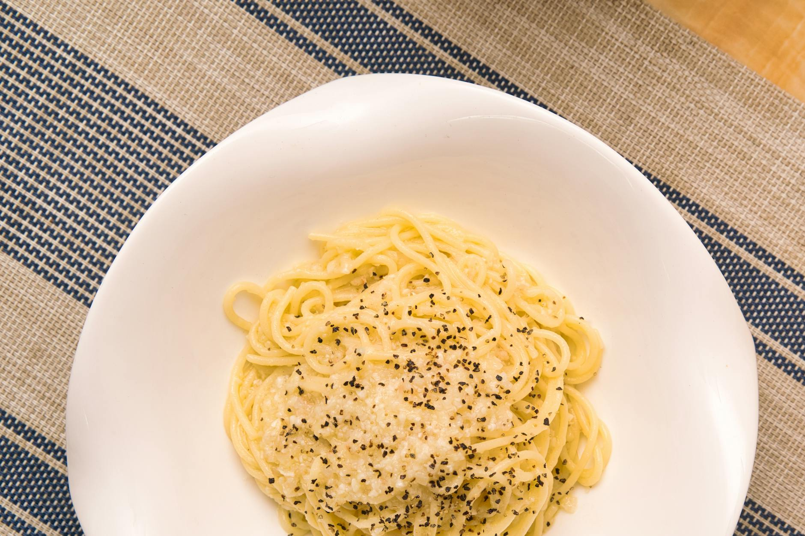

# Cacio e Pepe

*Roman pasta with three ingredients: Pecorino Romano, black pepper, pasta. Looks easy, isn't. The cheese must emulsify into the starchy water without scrambling. Worth practising; the result is the most luxurious cheese-and-pepper sauce you can make.*

**Serves:** 2

**Prep Time:** 5 minutes

**Cook Time:** 12 minutes

## Overview
Black pepper toasts in a dry pan; pasta cooks; the starchy pasta water plus finely grated Pecorino emulsify into a sauce off the heat. Heat shock scrambles the cheese; the technique is to take the pan off the heat before adding cheese, and toss energetically.

## Ingredients

- 200 g spaghetti or tonnarelli (better: bucatini)
- 100 g Pecorino Romano (very finely grated, plus extra for serving)
- 2 teaspoons coarsely cracked black peppercorns
- Salt for the pasta water (less than usual; pecorino is salty)

## Method

### Stage 1 – Pasta water
1. Bring 2 litres of water to the boil with a heaped teaspoon of salt (less than for normal pasta; the pecorino brings more).

### Stage 2 – Toast the pepper
1. While the water heats, place the pepper in a wide heavy pan over medium-low heat.
1. Toast for 1-2 minutes, swirling, until fragrant. Take off the heat.

### Stage 3 – Cook and reserve water
1. Drop the pasta in. Cook 2 minutes shy of al dente.
1. Lift out a mug of starchy water (about 200 ml). Drain the pasta but keep more water reserved.

### Stage 4 – Build the sauce
1. Splash 2-3 tablespoons of pasta water into the pepper pan. Bring to a simmer.
1. Add the pasta and toss vigorously over low heat, adding a little more water as needed to coat the strands.
1. CRUCIAL: Take the pan OFF the heat. Wait 30 seconds (heat shock scrambles cheese).
1. Tip in the grated pecorino and toss with tongs, adding small splashes of pasta water until the cheese melts into a glossy, creamy sauce that clings to the strands.

### Stage 5 – Serve
1. Plate immediately into warm bowls.
1. Top with extra pecorino and a final twist of pepper.

## Notes
- **Off the heat to add cheese:** This is the entire trick. Cheese added over heat clumps and goes stringy; cheese added off heat with hot pasta water emulsifies into a sauce.
- **Finely grate the pecorino:** Coarse grates clump. Use a microplane or the finest holes of a box grater.
- **Pasta water is the binder:** Without enough starch in the water, no emulsion. Don't drain the pasta down the sink first; reserve generously.

## Storage
- Doesn't keep. Eat immediately.
