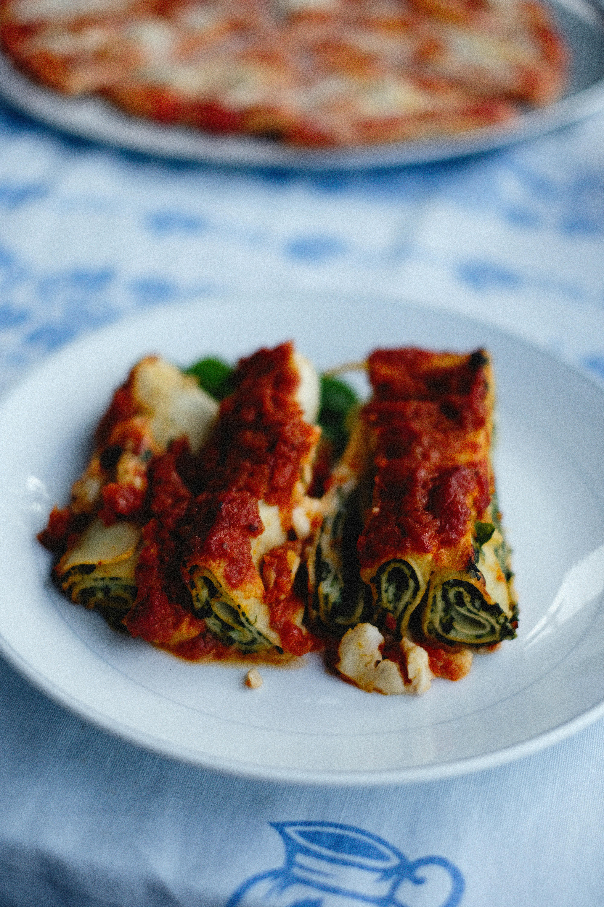

# Cannelloni Filled with Rocket, Spinach, and Ricotta Cheese

*Cannelloni del nonno, a classic Italian layered pasta dish that emerges from the oven golden, bubbling, and aromatic. Delicate fresh pasta sheets enclose a vibrant filling of ricotta, spinach, and rocket, bound together with nutmeg and Pecorino, then crowned with silken béchamel and tomato passata.*

**Serves:** 6-8

## Overview
This layered pasta masterpiece begins with fresh, delicate pasta sheets encasing a creamy, herbaceous filling. Ricotta and rocket provide lightness and peppery freshness, while spinach adds earthiness and color. The whole affair is bound with silken béchamel, enriched with tomato passata, and finished with a Pecorino crust that turns golden and crispy in the oven, a true celebration of Italian cooking.

## Ingredients

### Pasta & Sauces
- 400 grams fresh pasta dough
- 720 ml passata
- 15 fresh basil leaves
- 30 grams Pecorino (freshly grated)

### Ricotta Filling
- 500 grams ricotta cheese
- 150 grams frozen spinach (defrosted and squeezed dry)
- 150 grams rocket leaves (chopped)
- 60 grams Pecorino (freshly grated)
- 1/4 teaspoon nutmeg (freshly grated)
- Salt and pepper to taste

### Béchamel Sauce
- 100 grams salted butter
- 100 grams plain flour
- 1 litre full-fat milk (cold)
- 1/4 teaspoon nutmeg (freshly grated)

## Method

### Stage 1 – Prepare Sauces & Filling
1. Preheat oven to 180°C.
2. Pour passata into a large bowl with basil leaves and season with salt and pepper. Set aside.
3. Make béchamel: melt butter in a saucepan over medium heat. Stir in flour and cook for 1 minute until light brown.
4. Gradually whisk in cold milk, reduce heat, and cook for 10 minutes, whisking continuously until thickened.
5. Stir in nutmeg, season with salt and pepper, and set aside to cool slightly.
6. In a separate bowl, combine all filling ingredients: ricotta, spinach, rocket, Pecorino, nutmeg, salt, and pepper. Mix with a fork.
7. Refrigerate filling while preparing pasta.

### Stage 2 – Roll & Cut Pasta
1. Flatten prepared dough with a rolling pin and feed through pasta machine from widest to thinnest setting.
2. Lightly flour pasta on both sides throughout.
3. Cut into rectangles measuring 7 x 15 cm (you will need 26 sheets).

### Stage 3 – Cook Pasta Sheets
1. Bring a large saucepan of boiling salted water to the boil.
2. Working in batches of five, boil pasta sheets for 1 minute.
3. Remove immediately with a slotted spoon and place in a bowl of cold water.
4. Transfer to clean tea towels to dry.

### Stage 4 – Fill & Roll
1. Place 1½ tablespoons of filling across each pasta sheet.
2. Roll up from the narrow end, overlapping the pasta by about 2 cm to seal.

### Stage 5 – Assemble & Bake
1. Pour one-third of béchamel into a 25 x 35 cm rectangular baking dish. Spread evenly.
2. Place half the filled cannelloni seam-side down in the dish.
3. Spoon over half the passata and half the remaining béchamel.
4. Layer remaining cannelloni seam-side down, top with remaining passata and remaining béchamel.
5. Sprinkle Pecorino over the top.
6. Bake in the center of the oven for 35 minutes until golden and crispy.
7. Rest for 5 minutes before serving; this helps layers hold together.

## Notes
- **Fresh Pasta:** Fresh sheets make all the difference; the texture is incomparably silkier than dried sheets.
- **Béchamel:** The milk must be cold to avoid lumps. Whisking steadily is essential.
- **Filling Balance:** The nutmeg is crucial, a subtle bridge between the earthiness of spinach and the brightness of rocket.
- **Assembly:** Work orderly, as this is a labor-intensive dish but rewarding.

## Variations
**With Pesto:** Spread a thin layer of fresh basil pesto between the ricotta and passata for additional depth.
**Seafood Version:** Replace filling with cooked crab, ricotta, and herbs for an elegant variation.

## Serving
Serve with: A simple green salad dressed with vinaigrette
Garnish with: Fresh basil leaves and Pecorino shavings

## Storage
- Keeps 4 days refrigerated
- Can be assembled and frozen before baking up to 2 months (bake from frozen, adding 10 minutes)
- Reheats well gently covered in the oven at 160°C