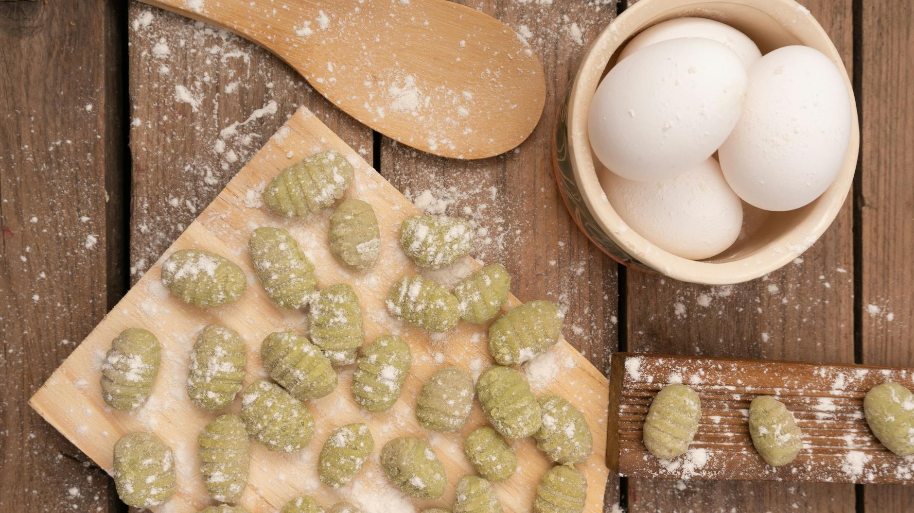

# Gnocchi

*Homemade gnocchi represents the pinnacle of Italian potato cookery. Oven-baked potatoes rendered through a ricer, combined with minimal flour and just an egg yolk, create the lightest, most ethereal pillows of dough. Boil them until they float to the surface, top with your favorite sauce, and savor the essence of simplicity elevated to art.*

**Serves:** 6

## Overview
These cloud-like gnocchi begin with whole, unpeeled potatoes baked until fluffy. When hot, they're passed through a ricer and built into a delicate dough with just flour and an egg yolk. The technique is straightforward but demands attention to detail: over-mixing creates dense, gluey gnocchi, while proper lightness produces tender pillows that absorb sauce beautifully.

## Ingredients

### Gnocchi Dough
- 1 kg flour potatoes (unpeeled)
- 1 egg yolk
- 90 grams plain flour
- Salt to taste

## Method

### Stage 1 – Bake Potatoes
1. Preheat oven to 200°C.
2. Prick potatoes all over with a fork.
3. Bake directly on the oven rack for 1 hour, or until completely tender.

### Stage 2 – Rice Potatoes
1. When cool enough to handle but still hot, peel the potatoes.
2. Pass the warm potato flesh through a potato ricer into a large bowl.
3. Push the riced potatoes through a sieve back into the bowl, discarding any strings.

### Stage 3 – Build Dough
1. Make a well in the center of the riced potatoes.
2. Add egg yolk and three-quarters of the flour.
3. Add half a teaspoon of salt.
4. Slowly work the mixture together with your fingers, handle minimally.
5. When a loose dough forms, transfer to a lightly floured surface.
6. Gently knead in the remaining flour.
7. Work until just combined; do not overwork.

### Stage 4 – Shape & Cook
1. Divide dough into eight portions.
2. Roll each piece gently into a 30 cm rope on a floured surface.
3. Cut into 1 cm pieces with a floured knife.
4. Using a fork, press each piece gently, rolling as you press to create an indent and grooved edge.
5. Lay finished gnocchi in a single layer on a tray lined with floured parchment.
6. Layer with more parchment and flour, repeating as needed.

### Stage 5 – Cook & Serve
1. Bring a large pan of salted boiling water to the boil.
2. Cook gnocchi for 2-3 minutes, or until they rise to the surface.
3. Transfer to a serving dish.
4. Top with your favorite sauce (pesto, tomato, cream, or butter and sage all work beautifully).
5. Finish with grated Parmesan and serve.

## Notes
- **Potato Selection:** Type matters significantly. Float potatoes in water before cooking, they'll identify themselves as floury (sink) or waxy (float). Use floury varieties only.
- **Minimal Handling:** The less you work the dough, the lighter the gnocchi. Stop as soon as dough comes together.
- **Baking Method:** Whole baked potatoes produce fluffier gnocchi than boiled; this matters tremendously.
- **Fork Technique:** This creates grooves to trap sauce and identifies homemade gnocchi.

## Variations
**Spinach Gnocchi:** Add 100g finely chopped spinach (squeezed dry) to the dough for color and earthiness.
**Semolina:** Substitute 30g of flour with fine semolina for slightly more texture.

## Serving
Serve with: Butter and sage, fresh pesto, tomato sauce, or creamy mushroom sauce
Garnish with: Freshly grated Parmesan and fresh basil or sage

## Storage
- Uncooked gnocchi freeze beautifully on a tray, then transfer to freezer bags for up to 1 month (cook from frozen, adding 1-2 minutes)
- Cooked gnocchi can refrigerate up to 2 days but are best eaten fresh
- Not suitable for long-term freezing once cooked