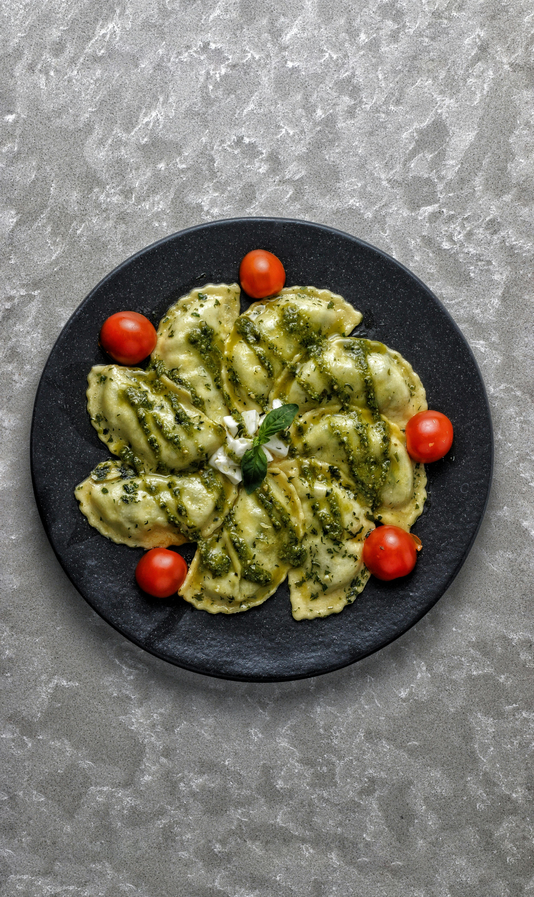

# Ham-Filled Pasta (Mezzelune)

*Mezzelune con prosciutto e pomodori secchi, these divine half-moon filled pastas showcase the delicate dance between creamy ricotta and Pecorino cheese, enriched with cooked ham and sun-dried tomato. Fresh basil ties everything together in a package of pure Italian comfort.*

**Serves:** 6

## Overview
These tender, handmade pasta parcels are filled with a harmonious mixture of ricotta, cooked ham, sun-dried tomatoes, and basil, bound with Pecorino cheese. They're served simply with a warm oil infused with crispy chorizo. The key is making fresh, tender pasta and not overfilling; quality matters more than quantity.

## Ingredients

### Pasta & Assembly
- 400 grams fresh pasta dough
- 2 eggs (beaten)
- 100 gram piece Pecorino cheese

### Ricotta Filling
- 750 grams ricotta cheese
- 200 grams cooked ham (finely chopped)
- 150 grams sun-dried tomato in oil (drained and chopped)
- 15 fresh basil leaves (chopped)
- 100 grams Pecorino cheese (freshly grated)
- Salt and pepper to taste

### Chorizo Oil
- 200 ml extra virgin olive oil
- 200 grams chorizo (cut into 5 mm slices)

## Method

### Stage 1 – Prepare Filling
1. Place all filling ingredients in a large bowl: ricotta, ham, sun-dried tomato, basil, and Pecorino.
2. Mix together with a fork until evenly combined but not over-worked.
3. Season with salt and pepper.
4. Cover with cling film and refrigerate for 10 minutes while preparing pasta.

### Stage 2 – Prepare Chorizo Oil
1. Meanwhile, put extra virgin olive oil in a frying pan over medium heat.
2. Add chorizo slices and fry for 3 minutes, stirring occasionally.
3. The chorizo will release its oil and flavor into the oil base.
4. Set aside to cool slightly, keeping warm.

### Stage 3 – Roll & Cut Pasta
1. Flatten prepared pasta dough with a rolling pin to fit pasta machine.
2. Flour pasta lightly on both sides.
3. Roll through pasta machine from widest to thinnest setting.
4. Keep dough dusted with flour throughout.
5. Lay pasta sheets on a well-floured surface.
6. Cut into discs using an 8 cm cutter (you should get about 30 discs).

### Stage 4 – Fill & Seal
1. Place about a teaspoon of filling in the middle of each disc, distributing filling equally.
2. Brush beaten egg around the edges of discs.
3. Fold over to make a half-moon shape.
4. Press down edges with fingertips to seal.
5. For decorative finish, press edges again with a fork.

### Stage 5 – Cook & Serve
1. Cook mezzelune in a large saucepan of boiling salted water for 1 minute (working in batches if necessary).
2. Drain and place in the middle of a large serving plate.
3. Season with salt and pepper.
4. Top with the warm chorizo oil and oil.
5. Sprinkle with shavings of Pecorino cheese.
6. Serve immediately.

## Notes
- **Fresh Pasta:** Homemade fresh pasta is essential to the delicate character of this dish; dried pasta is too tough.
- **Filling Amount:** Don't overfill; too much causes bursting during cooking. One teaspoon is precise.
- **Chorizo Oil:** Choose good quality Iberian chorizo; the flavor permeates the oil beautifully.
- **Pecorino Shavings:** Use a vegetable peeler to create elegant shavings.

## Variations
**With Ricotta Salata:** Crumble salted ricotta on top instead of fresh Pecorino.
**Different Meats:** Substitute cooked pancetta or prosciutto for variety.

## Serving
Serve with: A light red wine or crisp white wine
Garnish with: Fresh basil leaves and crushed pepper

## Storage
- Best served immediately after cooking
- Uncooked mezzelune freeze well on a tray for up to 1 month (cook from frozen, adding 1 minute)
- Cooked leftovers don't reheat well; prepare fresh for best results