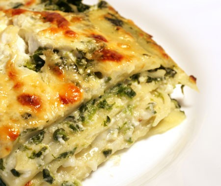

# Lasagne

*Lasagne con pesto*

*This is possibly one of the best lasagne recipes, the addition of the pesto compliments the béchamel sauce perfectly. Do not feel tempted to use shop bought lasagne sheets for this dish, take the time to make your own because they will melt in your mouth, and make this lasagne stand out above the rest and taste divine. Buon appetito!*

**Serves:** 6-8

## Overview
A rich, layered Italian baked pasta combining slow-cooked meat ragù with silky béchamel enriched with basil pesto. Homemade fresh pasta sheets are essential for the melt-in-the-mouth texture that sets this lasagne apart. The pesto adds a distinctive herbaceous note that complements the béchamel beautifully.

## Ingredients
- 3 tablespoons of olive oil
- 1 onion (peeled and finely chopped)
- 1 large carrot (peeled and finely chopped)
- 1 celery stick (finely chopped)
- 500 grams minced beef
- 350 ml Italian red wine
- 700 ml passata
- 1 tablespoon tomato purée
- 12 fresh lasagne sheets
- 50 grams cold salted butter (cut into 1 cm cubes)
- salt and pepper to taste

**For the béchamel**
- 100 grams salted butter
- 100 grams plain flour
- 1 litre cold full-fat milk
- 1/4 teaspoon nutmeg (freshly grated)
- 100 grams Parmesan (freshly grated)

**For the pesto**
- 40 grams fresh basil leaves
- 1 garlic clove (peeled)
- 30 grams pine nuts
- 120 ml extra virgin olive oil
- 20 grams Parmesan (freshly grated)
- pinch of salt

## Method

### Stage 1 – Make Pesto
1. Place basil, garlic, and pine nuts in a food processor.
2. Pour in the oil and purée for about 20 seconds until smooth.
3. Transfer to a bowl and fold in Parmesan.
4. Season lightly with salt. Set aside.

### Stage 2 – Make Meat Sauce
1. Preheat oven to 180°C / 160°C fan.
2. Heat olive oil in a large saucepan and cook onions, carrot, and celery for 5 minutes over medium heat.
3. Add minced beef and cook for a further 5 minutes, stirring until colored all over.
4. Season with salt and pepper, cook for another 5 minutes, stirring occasionally.
5. Pour in wine, stir, and cook for about 3 minutes to allow alcohol to evaporate.
6. Add passata and tomato purée, lower heat to a bare simmer.
7. Cook uncovered for 1 hour until rich and thick.
8. After 30 minutes, taste and adjust seasoning.

### Stage 3 – Make Béchamel
1. Melt butter in a saucepan over low heat.
2. Add flour and stir with a whisk, cooking gently for 2-3 minutes to make a white roux.
3. Pour cold milk onto the roux, whisking continuously.
4. Bring to a boil over medium heat, whisking constantly.
5. When boiling, lower heat and simmer gently for about 10 minutes, stirring frequently.
6. Season to taste with salt and pepper.
7. Add nutmeg.
8. Pass through a fine-meshed sieve.
9. Stir in half of the Parmesan and all of the pesto. Set aside.

### Stage 4 – Assemble
1. Spread one-quarter of the béchamel-pesto sauce over the bottom of a deep 30 x 25 cm oven-proof dish.
2. Lay about 4 lasagne sheets on top, trimming to fit.
3. Spread half of the meat sauce over the pasta.
4. Top with one-third of the remaining béchamel sauce.
5. Lay four more sheets on top.
6. Cover with remaining meat sauce.
7. Spread half of the remaining béchamel sauce on top, ensuring all pasta is covered.
8. Sprinkle with remaining Parmesan and scatter cubed butter over the top.
9. Grind four turns of black pepper over the surface.

### Stage 5 – Bake
1. Place on bottom shelf of oven for 30 minutes.
2. Move to middle shelf and increase temperature to 200°C / 180°C fan for further 15 minutes until golden and crispy all over.
3. Rest for 5-10 minutes out of oven before serving; this allows layers to hold together for easier cutting.

## Notes
- **Fresh Sheets:** Homemade fresh pasta is essential; dried sheets lack silken texture and flavor.
- **Pesto Subtlety:** The pesto provides herbaceous notes without overwhelming; it should enhance, not dominate.
- **Béchamel Consistency:** Must be smooth and thick enough to hold layers together but creamy enough to coat pasta.
- **Resting Time:** Crucial for neat serving and allowing flavors to meld.

## Variations
**Vegetarian:** Replace meat sauce with sautéed mushrooms, spinach, and walnuts.
**Seafood:** Layer with crab and shrimp instead of beef for a lighter, luxurious variation.

## Serving
Serve with: A simple green salad with vinaigrette dressing
Garnish with: Extra Parmesan shavings and fresh basil

## Storage
- Keeps 4-5 days refrigerated
- Can be assembled and frozen unbaked for up to 1 month (add 10 minutes to baking time)
- Reheats well covered gently at 160°C