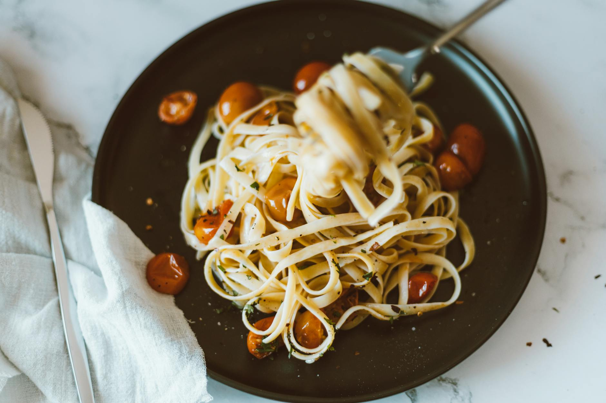

# Linguine with Cherry Tomatoes, Pancetta, and White Wine

*Linguine alla amatriciana, originating from Amatrice in Lazio, this dish combines the holy trinity of pancetta, onion, and chilli to create a sauce that's far greater than its simple components suggest. The tomatoes add brightness, while the wine provides depth.*

**Serves:** 4

## Overview
This Roman classic showcases the magic of combining quality ingredients in the right proportions. Crispy pancetta, yielding its fat to the pan, mingles with soft onions and fierce chilli. A splash of white wine adds acidity and complexity. The result is a robust, warming sauce that transforms simple pasta into something memorable. Pecorino Romano provides a sharp finish.

## Ingredients

### Sauce Base
- 4 tablespoons olive oil
- 1 large red onion (peeled and finely sliced)
- 250 grams diced pancetta
- 100 ml dry white wine
- 1/2 teaspoon dried chilli flakes

### Tomatoes & Finishing
- 800 grams cherry tomatoes (tinned, or fresh and de-seeded)
- 3 tablespoons fresh flat-leaf parsley (finely chopped)
- 100 grams Pecorino Romano (freshly grated)
- Salt to taste

### Pasta
- 500 grams linguine

## Method

### Stage 1 – Cook Pancetta & Onion
1. Heat oil in a large frying pan over medium heat.
2. Add sliced red onion and fry, stirring with a wooden spatula.
3. Add diced pancetta and continue cooking for a further 3 minutes.
4. The pancetta releases its fat and browns slightly.

### Stage 2 – Deglaze
1. Pour in white wine and cook for a further 2 minutes to allow alcohol to evaporate.

### Stage 3 – Add Tomatoes & Simmer
1. Add cherry tomatoes and chilli flakes.
2. Stir well and gently simmer uncovered for 8 minutes.
3. Stir every couple of minutes for even cooking.
4. Once the sauce is ready, season with salt.
5. Remove from heat and set aside.

### Stage 4 – Cook Pasta & Combine
1. Meanwhile, cook pasta in a large saucepan of salted boiling water until al dente.
2. Drain thoroughly and tip back into the same pan.
3. Pour the sauce into the pasta pan and add the fresh parsley.
4. Stir everything together for 30 seconds to allow flavors to combine.

### Stage 5 – Serve
1. Divide among warmed bowls.
2. Serve immediately, sprinkled abundantly with Pecorino Romano.

## Notes
- **Pancetta Selection:** Good quality pancetta sets the tone for this dish; it should have visible marbling.
- **Chilli Heat:** Dried flakes provide steady, consistent heat. Adjust to your preference, but the chilli should be noticeable.
- **Tomato Prep:** Fresh tomatoes should have seeds removed to prevent watery sauce. Tinned are reliable in winter.
- **Wine Choice:** A dry white wine without too much oak works best; it should add acid, not flavor.

## Variations
**With Fresh Tomatoes:** Use 800g fresh, ripe tomatoes, de-seeded, during summer months.
**Spicier Version:** Add fresh red chilli instead of flakes for more pronounced heat.

## Serving
Serve with: Crusty bread for sauce soaking, and a fragrant white wine
Garnish with: Abundant Pecorino Romano, fresh parsley, and cracked black pepper

## Storage
- Keeps 3-4 days refrigerated
- Freezes well up to 2 months (thaw fully before gentle reheating)
- Best eaten within 24 hours for optimal flavor