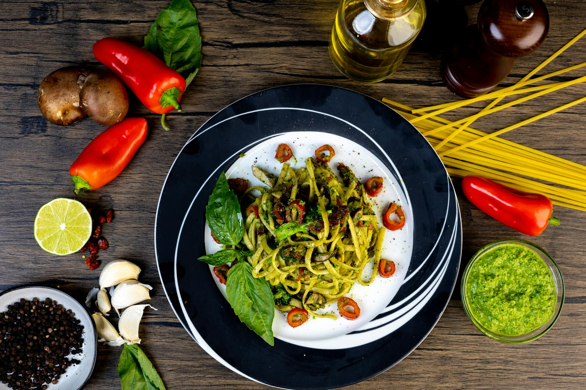

# Linguine with Genovese Basil Pesto

*Linguine al pesto Genovese, one of Italy's most iconic sauces paired with delicate linguine. This is summer on a plate: raw basil, toasted pine nuts, fruity olive oil, and aged Parmesan. Absolutely nothing more is needed. Serve with fresh warm bread and crisp white wine.*

**Serves:** 4

## Overview
True pesto is made by hand, not blended, but a food processor creates acceptable results efficiently. The beauty of pesto lies in the balance: each ingredient must be the highest quality. The basil must be fresh, the pine nuts toasted, the oil fruity but not aggressive, the Parmesan aged. Together they create something transcendent.

## Ingredients

### Pesto
- 50 grams fresh basil leaves (only the leaves, not stems)
- 50 grams pine nuts
- 1 garlic clove (peeled)
- 130 ml extra virgin olive oil
- 25 grams Parmesan (freshly grated)
- Salt and pepper to taste

### Pasta
- 500 grams linguine

## Method

### Stage 1 – Make Pesto
1. Place basil leaves, pine nuts, and garlic in a food processor.
2. Drizzle in the oil and purée to a smooth paste.
3. Transfer the basil mixture into a large bowl.
4. Fold in the Parmesan gently.
5. Season with a little salt and pepper to taste.

### Stage 2 – Cook Pasta
1. Cook linguine in a large saucepan of boiling salted water until al dente.

### Stage 3 – Combine & Serve
1. Drain pasta and tip into the bowl with pesto.
2. Toss everything together for 30 seconds to allow pesto to coat pasta evenly.
3. Serve immediately in warmed bowls.

## Notes
- **Basil Quality:** Genovese basil from the Liguria region is finest, but use the freshest available locally during peak season.
- **Pine Nuts:** Freshness matters tremendously; rancid nuts ruin the dish. Toast lightly before using.
- **Temperature:** Pesto should remain cool; adding it to hot pasta cooks it slightly, darkening color and muting flavor, but this is traditional.
- **Minimal Processing:** Use a food processor briefly; over-processing creates a paste rather than a sauce.

## Variations
**Walnut Pesto:** Substitute toasted walnuts for pine nuts for earthier flavor and lower cost.
**With Cream:** Fold 50ml double cream into the pesto for richness.

## Serving
Serve with: Fresh warm bread and a glass of dry white wine (Vermentino or Sauvignon Blanc)
Garnish with: Extra basil leaves and Parmesan shavings

## Storage
- Best eaten immediately after preparation
- Pesto can be stored refrigerated for 3-4 days in an airtight container with plastic wrap pressed onto surface to prevent browning
- Freeze successfully in ice cube trays for up to 3 months (thaw gently before using)