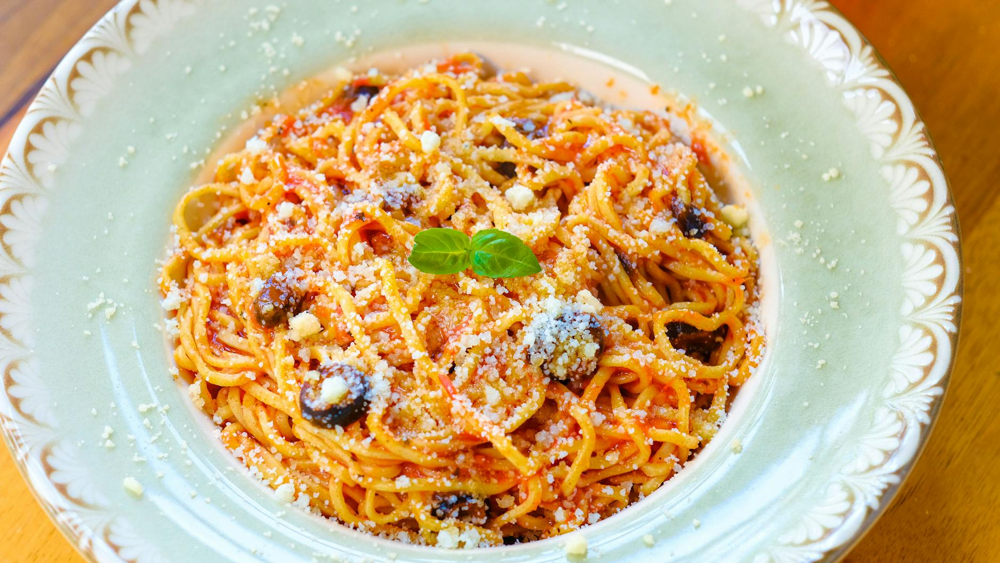

# Pasta Puttanesca

*Naples-style sauce of tomatoes, anchovies, capers, olives and garlic, traditionally served over spaghetti. The bold-flavoured "anything in the cupboard" pasta. Etymology disputed; the name translates as "whore-style" with several origin stories of varying credibility.*

**Serves:** 4

**Prep Time:** 10 minutes

**Cook Time:** 20 minutes

## Overview
Anchovies dissolve into hot olive oil with garlic and chilli; tomatoes simmer briefly with capers and black olives; the lot tosses with hot spaghetti. Twenty minutes from cupboard to plate. The salty, savoury, briny depth comes from ingredients that keep almost forever.

## Ingredients

- 400 g spaghetti
- 4 tablespoons olive oil
- 6 anchovy fillets in oil (drained)
- 4 garlic cloves (sliced)
- ½ teaspoon dried chilli flakes
- 2 tablespoons capers in brine (rinsed)
- 100 g pitted black olives (Kalamata or similar, halved)
- 400 g tinned chopped tomatoes (or 6 ripe tomatoes, chopped)
- A handful of flat-leaf parsley (chopped, to finish)
- Salt and freshly ground black pepper

## Method

### Stage 1 – Pasta
1. Bring a large pan of well-salted water to the boil.
1. Add the spaghetti; cook to al dente, about 2 minutes shy of the packet time.

### Stage 2 – Sauce
1. While the pasta boils, heat the olive oil in a wide pan over medium-low heat.
1. Add the anchovy fillets and stir until they dissolve into the oil (1-2 minutes).
1. Add the garlic and chilli flakes; cook 1 minute (don't brown the garlic).
1. Add the capers and olives; cook another minute.
1. Tip in the tomatoes; simmer for 8-10 minutes until thickened slightly. Don't season with salt yet (the anchovies, capers and olives bring plenty).

### Stage 3 – Combine
1. Lift the pasta into the sauce with tongs (don't fully drain; the starchy water helps).
1. Add a splash of pasta water; toss vigorously over medium heat for 1-2 minutes until the sauce coats every strand.
1. Taste; adjust with salt only if needed.
1. Stir through most of the parsley.

### Stage 4 – Serve
1. Pile into bowls; scatter the rest of the parsley. Drizzle with a little olive oil.

## Notes
- **Anchovies dissolve:** They don't taste of fish in the finished dish; they taste of savoury depth. Don't skip them.
- **No cheese:** Traditionally puttanesca isn't served with parmesan; the sauce is too salty for it.
- **Don't drain the pasta into a sieve:** Lift with tongs so the starchy water clings to the pasta and helps the sauce emulsify.

## Storage
- Keeps 2 days refrigerated. Reheats reasonably with a splash of water; the pasta loses some bite.
