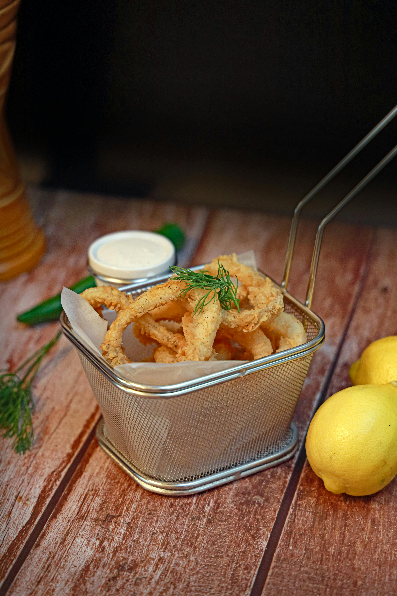

# Pasta Shells and Beans with Squid and Chorizo

*Orecchiette con calamari e chorizo, the flavors and colours of this dish are simply amazing. Shell pasta captures the delicate sauce in its curves, while squid, chorizo, beans, and tomatoes create complexity and visual appeal. This is a perfect party pasta.*

**Serves:** 6

## Overview
This colorful, flavorful dish combines tender squid, spiced chorizo, creamy beans, and bright tomatoes. The squid is scored to create attractive curl patterns when seared at high heat. Orecchiette (small shell pasta) catches the light sauce beautifully. This is as much about presentation as it is flavor, perfect for entertaining.

## Ingredients

### Sauce & Vegetables
- 100 grams tinned chick peas (drained)
- 100 grams tinned borlotti beans (drained)
- 15 cherry tomatoes (quartered)
- 1 medium-hot red chilli (de-seeded and thinly sliced)
- 1 garlic clove (peeled and finely chopped)
- 3 tablespoons fresh flat-leaf parsley (chopped)
- 2 tablespoons fresh lemon juice
- 8 tablespoons extra virgin olive oil
- Salt to taste

### Seafood & Meat
- 400 grams squid (cleaned)
- 80 grams chorizo (thinly sliced)

### Pasta
- 500 grams orecchiette shells

## Method

### Stage 1 – Prepare Sauce Base
1. Put chickpeas and borlotti beans in a large bowl with tomatoes, chilli, garlic, and parsley.
2. Pour in lemon juice and 5 tablespoons of the oil.
3. Season with salt and toss gently together.
4. Set aside.

### Stage 2 – Prepare Squid
1. Cut open the body pouch of each squid along one side.
2. Using a small sharp knife, score the inner side into a fine diamond pattern.
3. Cut each pouch first in half length-ways, then across into 7 cm pieces.

### Stage 3 – Cook Squid & Chorizo
1. Heat the remaining oil in a large frying pan over high heat.
2. Add squid pieces scored-side up so they curl attractively when cooked.
3. Also add squid tentacles.
4. Sear for about 30 seconds.
5. Turn them over and sear for another 30 seconds until golden and caramelized.
6. Season with salt.
7. Add chorizo to the pan and cook for a further minute, keeping heat high.
8. Set aside.

### Stage 4 – Cook Pasta & Combine
1. Cook pasta in a large saucepan of boiling salted water until al dente.
2. Drain thoroughly and return to the same pan.
3. Return saucepan to low heat and pour in the bean mixture, squid, and chorizo.
4. Stir everything together for 1 minute to allow flavors to combine.

### Stage 5 – Serve
1. Divide into warmed bowls.
2. Serve immediately.
3. Do NOT add grated cheese on top; the delicate squid flavor would be masked.

## Notes
- **Squid Selection:** Cleaned squid should smell fresh and sea-like, not "fishy."
- **Scoring Technique:** The scoring creates visual appeal and prevents curling too tightly.
- **High Heat:** Essential for caramelizing squid quickly; slow cooking makes it tough.
- **No Cheese:** This is crucial, Parmesan and squid are incompatible partners.

## Variations
**Shellfish Version:** Add fresh clams or mussels instead of squid.
**White Bean Version:** Use all white beans and skip the chorizo for lighter preparation.

## Serving
Serve with: Crisp white wine (Pinot Grigio or similar), no cheese
Garnish with: Fresh flat-leaf parsley and lemon wedges

## Storage
- Best eaten immediately; the squid texture suffers if reheated
- Not recommended for refrigeration or freezing
- This is a dish for immediate enjoyment